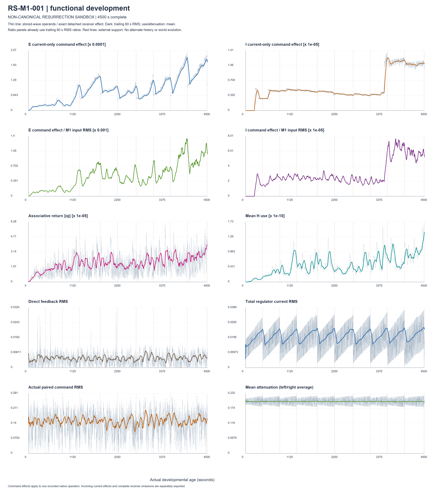
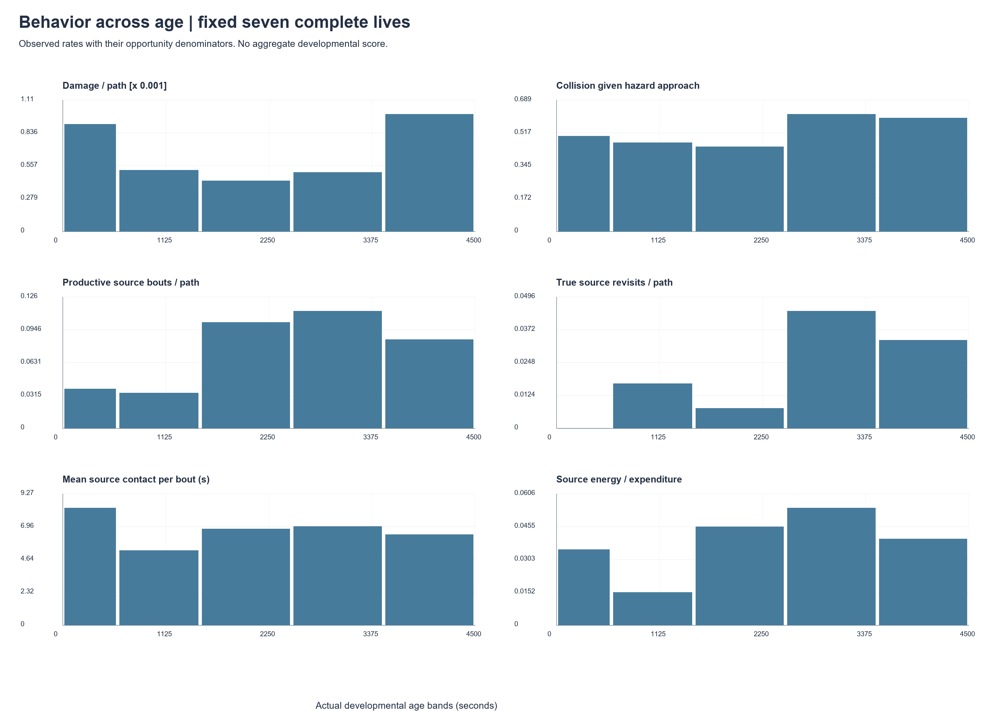

# Functional expression over time v0.1

**NON-CANONICAL RESURRECTION SANDBOX — PASSIVE ANALYSIS.** Prepared 1 October 2026. No new simulation, continuation, alternate trajectory, parameter change or canon change.

**Learned expression is still changing at the observed endpoint, but it is not uniformly increasing and this record does not establish learned behavioural improvement.** E-current influence on one outgoing motor operation has a positive final-1000-second slope in five of the seven complete lives. Its ratio to M1 rises in four. I, q and H-use show mixed, sometimes event-driven histories. Productive source interactions become more frequent per unit path in the middle periods; dwell and environmental energy contribution do not improve monotonically. Late damage increases. Strong positive episodes and adverse episodes both remain in the report.

Open [REVIEW.html](REVIEW.html) for all figures; use [the standing watchlist](BEHAVIOURAL_DEVELOPMENT_WATCHLIST_v0_1.md) as an observer-analysis aid. It is not a score, doctrine or mechanism selection. Exact tables, signed paired command deltas, sparse checkpoint calculations, analysis source and verification records accompany this document.

## Evidence and denominator

| Histories | Physical evidence used | Functional curves used | Treatment |
| --- | --- | --- | --- |
| RS-M1-001–007 | Birth to 4500 s | Completed waves through 4500 s | Fixed seven for longitudinal population comparisons |
| RS-M1-008 | Durable native prefix through 2968.9548705465913 s | Through last complete causal checkpoint, 2939.9548705459583 s, native 294000 | Host-censored; never extended or pooled as a 4500-s life |
| RS-M1-009–012 | Birth to 600 s | Completed 600-s pilots | Overnight unstarted; plotted individually, never treated as complete long lives |

The original task reached seven common-target completions, then a native host memory-access failure in 008. There was no retry. All available histories total 36,868.95487054659 bodily seconds. There are 77 actual energy interventions, injecting 53.9 E; no actual integrity-support interventions. Recorded environmental energy is 2.342139759762746 and expenditure is 59.935575449394385 across the available denominator. Quarantining resurrection from learning credit does not remove its effect on energy, capability or subsequent state visitation.

Reference code checkpoint: `1d7cd6fd450ea528562b2c825589ab4de18a5b38`; preserved P identity: `6bc9683b54e4fa80136fe8534d7713e2a250a95f`; non-canonical sandbox runtime identity: `752b7c335347a5f55fd3e7cdf1b904137d41e5b229b8ea2252caa8e12a455f3c`. These are evidence identities, not new authorities. The sandbox already contains the explicitly commissioned M1 process and resurrection wrapper; this analysis changes neither.

Original evidence archive SHA256: `a165c5c48e4b9ed6a84a8ba02b7b1bc23ca57f43f38bfe6d0058694969e7e651`. All 37,909 execution files were rehashed against `EXECUTION_CUSTODY_SEAL.json`; all matched. Bound source files and the original archive also matched. The previous `H_E_I_DEVELOPMENTAL_CURVES_v0_1.md` and its review package remain preserved. This report addresses the present functional/behavioural request; it does not declare every item of the earlier broader analysis programme complete.

## What “command effect” measures

Every plotted operand comes from an actual stored wave or its associated recorded native operation. A wave's new outgoing regulator output belongs to the *next* motor use; its motor diagnostic used the previous wave's controls. The analysis shifts those controls by one wave, uses the birth output at the start, and verifies current, attenuation, associative motor input and actual command identities. The maximum disagreement is below $10^{-14}$.

For a bank's learned-current omission, retain the recorded spontaneous drive, direct feedback, associative input, regulator exploration, body-need weights, preceding tendency and attenuation. Let $z$ be the recorded total input, $\Delta c$ the bank's learned-current contribution at that receiver, $a$ attenuation and $\alpha=1-\exp(-\Delta t/0.1)$, using that operation's actual elapsed interval. Then

$$\Delta u_{\rm current}=(1-a)\,\alpha\,[\tanh(z)-\tanh(z-\Delta c)].$$

This is detached algebra at **one recorded operation**, not a new motor/world step or an accumulated alternative history. A separate full-receiver result removes the same bank's learned current **and** attenuation contribution at that receiver. It is not a full-bank causal ablation: prior tendency, H, feature history and support-mediated history stay as recorded. The paired signed differences are exported; plots summarize their RMS, which discards direction.

Plots show raw measured/derived traces and trailing 60-s summaries. E/M1 and I/M1 divide trailing command-effect RMS by trailing *M1 input* RMS. Those signals sit at different points in the motor path, so a second comparator removes M1 at the same recorded receiver. This prevents the normal 0.01-s motor smoothing factor from masquerading as special suppression of learning. No plot is a simulated counterfactual. Completed waves stop just before the physical age boundary when the wave cadence does not land on it; the analysis never fabricates a final wave. Exact last-wave and physical-prefix ages are in DELIVERY_VERIFICATION.json.

## Is expression still growing?

The following are robust final-1000-second changes: Theil–Sen slopes on five-second medians, multiplied by 1000. They describe 3500–4500 s, not the derivative of the final sample, a significance test or a forecast. Fixed 300/600-s windows, OLS comparison and early/middle/late summaries are in the tables. Functional early/middle/late windows for complete lives are 0–1000, 1750–2750 and 3500–4500 s; behavioural bands below intentionally differ. Short/censored histories use their available thirds, capped at 1000 s, and never supply a 4500-s claim.

| Life | Δ E command effect | Δ I command effect | Δ E/M1 ratio | Δ I/M1 ratio | Δ q norm | Δ H-use |
| --- | --- | --- | --- | --- | --- | --- |
| RS-M1-001 | 0.00011819 | -8.28885e-07 | 0.000466011 | -5.99563e-06 | 1.03351e-05 | 4.51854e-11 |
| RS-M1-002 | 2.22376e-05 | -1.02694e-06 | 0.000249305 | 3.77813e-06 | -3.99292e-06 | -2.82776e-11 |
| RS-M1-003 | 6.40595e-06 | -1.53049e-06 | -0.000153055 | 3.43217e-07 | 9.60614e-06 | 4.75918e-11 |
| RS-M1-004 | -2.53211e-05 | -5.3656e-08 | -0.000167393 | -4.76153e-07 | 3.56224e-06 | 3.4065e-11 |
| RS-M1-005 | 6.70994e-05 | 3.21926e-08 | 0.00030502 | 7.71279e-07 | -4.43316e-08 | -1.08383e-11 |
| RS-M1-006 | -1.02296e-05 | 9.92787e-07 | -3.57807e-05 | 6.01225e-06 | -1.3762e-06 | -1.15402e-11 |
| RS-M1-007 | 1.04078e-05 | 2.05916e-06 | 8.72739e-05 | 2.45717e-05 | -3.35926e-06 | -3.24432e-11 |

1. **E influence still increasing?** Yes over the final window in 001, 002, 003, 005 and 007; decreasing in 004 and 006. The whole early-to-late command-effect level rises in all seven, which is a different question from its last-window slope.
2. **I influence still increasing?** Final-window slopes are positive in 005, 006 and 007, negative in 001–004. The positive 005 slope is extremely small despite its very late damaging events; a robust slope can underrepresent an endpoint jump. Use the raw trace and local windows, not a single line fit, for that history.
3. **q still increasing?** Positive final-window slopes in 001, 003 and 004; essentially flat/slightly negative in 005; negative in 002, 006 and 007.
4. **H-use still increasing?** Positive in 001, 003 and 004; negative in 002, 005, 006 and 007. It fluctuates with the experienced state and is not equivalent to H storage norm.
5. **Gaining on M1?** E/M1 increases in the final window in 001, 002, 005 and 007; falls in 003, 004 and 006. I/M1 is also mixed. Expression remains small on these recorded receiver comparisons, but “permanently small” cannot be inferred from a finite 4500-s record. There is neither evidence of uniform saturation nor a justified extrapolation to future dominance.
6. **Does storage growth predict expression growth?** Sometimes, incompletely. Across fifteen 300-s windows, E-norm/command-effect level correlations range 0.424–0.939. First-difference correlations fall to 0.116–0.739; detrending age produces negative associations in 002 and 006. Serial dependence, shared body state and concurrent exposure prevent a predictive or causal reading. In 006, late E-bank storage grows while immediate current/command expression declines: a particularly clear counterexample to “more stored norm means more current control.”

These conclusions concern magnitude. A small directional contribution can matter in a sensitive trajectory, and a large contribution can be unhelpful. Neither usefulness nor ineffectiveness follows from these curves alone.

## Stored structure → receiver → motor command

Late-window scale comparisons follow. “Same receiver %” compares E's current-only command delta to M1's command delta computed at the same operation. Full E receiver includes its learned attenuation contribution and may exceed the current-only effect. All are detached local diagnostics.

| Life | E norm mean | E current RMS | E command RMS | E full-receiver RMS | E/M1 input % | E/M1 same receiver % | I/M1 same receiver % |
| --- | --- | --- | --- | --- | --- | --- | --- |
| RS-M1-001 | 0.01664 | 0.00223389 | 0.000163638 | 0.000208857 | 0.08433 | 1.13373 | 0.0778197 |
| RS-M1-002 | 0.0128055 | 0.00143024 | 0.000105392 | 0.00022555 | 0.0594088 | 0.79795 | 0.0453841 |
| RS-M1-003 | 0.01628 | 0.0020654 | 0.000152099 | 0.000167871 | 0.0818367 | 1.09781 | 0.136222 |
| RS-M1-004 | 0.00997263 | 0.000927904 | 6.8315e-05 | 0.00023446 | 0.0368642 | 0.494516 | 0.00497147 |
| RS-M1-005 | 0.0177323 | 0.000956493 | 7.0821e-05 | 0.00019196 | 0.0417164 | 0.558894 | 0.00613155 |
| RS-M1-006 | 0.0175285 | 0.000416707 | 3.0529e-05 | 0.00027742 | 0.0159617 | 0.214739 | 0.00625442 |
| RS-M1-007 | 0.0143966 | 0.000872771 | 6.42953e-05 | 0.000173033 | 0.0356953 | 0.478691 | 0.044064 |

The current-only late E/M1-input ratio is 0.01596–0.08433%; against M1 at the same receiver it is 0.2148–1.1336%. I's same-receiver ratio is 0.00497–0.1362%. These different denominators explain why the command ratios are smaller than the earlier incoming-current ratios; they are not contradictory results.

**E and I:** bank norms aggregate support, current and attenuation rows; only some rows directly drive the two motor currents. `SPARSE_ASSOCIATIVE_FEATURE_EFFECT.csv` separates those row norms and current logits at 807 preserved checkpoints. Command-per-bank-norm curves describe readout/coupling, not efficiency of learning. A zero-norm ratio is undefined, not zero; 010 has no I-bank growth or learned I command effect in its pilot. Body features and bias terms also contribute to regulator readout, so learned regulator expression need not mean sensory-context discrimination.

**H:** H norm, H-use and q are different quantities. q/H and H-use/H ratios, direct associative motor-command effect and the sparse q-feature→regulator pathway are exported separately. In the seven late windows the mean direct associative motor-command effect is approximately $5.48\times10^{-8}$–$1.29\times10^{-7}$. Across 807 exact checkpoint feature calculations, the maximum q-feature contribution to regulator current is $8.18454\times10^{-10}$ RMS; maxima for attenuation and support are $7.86456\times10^{-10}$ and $9.16677\times10^{-10}$. This sparse pathway diagnostic is not represented as a dense measured curve. It uses the stored feature body operands even when a resurrection leaves an output based on preceding operands.

**Where is the apparent restriction?** There is small associative return/use and especially weak associative modulation of the regulator feature readout. The learned E/I currents are small relative to the existing M1 input, and whole-bank storage does not guarantee large current-row output. Downstream attenuation is around 0.2, so roughly 80% remains; the minimum recorded local target-to-command gain before the ordinary smoothing factor is about 0.668. The receiver is therefore not saturated shut. Normal motor smoothing reduces any one native operation's response, including M1. These observations localize current scale restrictions but do not identify a production defect or authorize a parameter change.

## Behaviour with actual opportunity denominators

The fixed seven complete lives contribute to every band. Counts divide by their actual time/path; approaches and contact are separate. A genuine observer hazard approach enters surface gap ≤0.5, has closing motion >0.01 units/s and ends beyond gap 1.0; birth-near and unfinished episodes are excluded from conditional approach rates, while their recorded contacts remain in raw totals. Sensitivity uses 0.25/0.5 and 1.0/1.5. This is an explicit operational subset of hazard opportunities, not omniscient proof of every possible encounter.

Source contact fragments are grouped only if the gap is ≤1 s and intervening surface clearance ≤0.25. A true same-source return requires leaving beyond 0.25. Source-neighbourhood returns require leaving beyond 1.5 then re-entering within 1.0. Nine contact-grouping definitions preserve the same total energy/contact ledger. The thresholds are observer definitions, never organism inputs.

| Age band (s) | Path | Hazard approaches | Collision/approach | Damage/path | Productive bouts/path | True revisits/path | Mean source dwell (s) | Source E / expense % |
| --- | --- | --- | --- | --- | --- | --- | --- | --- |
| 0–600 | 184.266 | 36 | 0.5 | 0.000910386 | 0.0379885 | 0 | 8.28088 | 3.4895 |
| 600–1500 | 236.618 | 45 | 0.466667 | 0.00051947 | 0.0338098 | 0.0169049 | 5.27122 | 1.51419 |
| 1500–2500 | 264.9 | 36 | 0.444444 | 0.000429597 | 0.101925 | 0.00755002 | 6.79342 | 4.54615 |
| 2500–3500 | 248.534 | 39 | 0.615385 | 0.000502676 | 0.112661 | 0.0442595 | 6.96712 | 5.41317 |
| 3500–4500 | 270.043 | 42 | 0.595238 | 0.000995086 | 0.0851715 | 0.033328 | 6.41226 | 3.98832 |

All 35 organism/band rows include collisions/minute and/path, peaks, isolated closing speed, sustained force, total damage/path, contact/pinned time, near-miss clearance, source approaches/exposure, productive bouts, distinct sources, true revisits and latency/path, brushes, 5/30-s retention, departure speed, repair, E/I/speed, coverage, recurrence, occupancy entropy, effort, curvature proxy and forward/reverse bouts. `AGE_BAND_STATUS_ANNOTATIONS.csv` explicitly marks improving/worsening *descriptive* directions against the preceding band, no-opportunity cells, mixed spatial interpretation and unresolved causality. It is not a developmental score.

Fine solver fragments allocate source-contact duration to age bands; physical amounts use exact event endpoints. Whole-bout dwell/transfer summaries and peaks belong to the bout's onset band, so a cross-boundary bout can contribute duration outside that band's wall span. Instantaneous-impact damage per collision excludes sustained-stress damage; total damage/path includes both. Individual opportunities may concern overlapping colliders; “seconds near any hazard” is a union, while approach counts are collider-specific. No-opportunity means undefined, not failure or zero success.

### Answers to the eight behavioural priority questions

**1. Does collision force/damage fall after controlling opportunity and capability? Unresolved; no robust positive result.** Pooled damage/path falls in the middle, then reaches 0.000995 in the last band versus 0.000910 early. Collision-given-approach is 0.500 early and 0.595 late. Matching the same organism and hazard family with E, I and speed strata leaves only **three early and three late approaches**, in three shared strata. Their collision fractions are 0.667 and 1.0; mean peak impulse 0.0384 and 0.3184; mean damage/approach 0.00130 and 0.03424. This tiny overlap is insufficient, and mover-relative closing speed still differs (0.183 versus 0.298). Raw reductions in 001/002 do not establish acquired avoidance; low E, different hazard exposure and stochastic movement remain alternatives.

**2. Do visits/revisits rise relative to path/exposure? Partly.** Productive bouts/path rise from 0.038 early to 0.102 and 0.113 in the two middle-late bands, then 0.085 in the last. True revisits/path rise from zero early to 0.0443 then 0.0333. The source-approach denominator is only 4, 13, 10, 11 and 8 across the five bands; source-neighbourhood opportunities are sparse and uneven. More repeated coupling is observed, but source-seeking competence is not established.

**3. Does productive dwell increase? Not consistently.** Mean contact per source bout is 8.28, 5.27, 6.79, 6.97 and 6.41 s. One late bout is nonproductive and remains included in this all-contact statistic. The separate productive-only event rows allow that distinction. Some individuals have much longer later bouts; the population sequence is not a monotonic increase. Dwell can reflect geometry, low speed, pressure and stock, rather than retentive learning.

**4. Do resurrection intervals lengthen? Mixed, with continuing support dependence.** Completed energy-ended intervals are analysed separately from administrative/censored tails. Their robust duration slopes are positive in five complete lives and negative in 004/006, generally small and irregular; early 004/006 intervals are among the longer ones. First/last intervals alone would tell a different and incomplete story. The complete interval table retains source energy, expenditure, path, sources, contacts and revisit counts for every epoch.

| Life | Complete energy-ended epochs | First duration (s) | Last completed duration (s) | Duration slope (s/s) |
| --- | --- | --- | --- | --- |
| RS-M1-001 | 10 | 430.335 | 494.276 | 0.000463684 |
| RS-M1-002 | 9 | 428.658 | 489.426 | 0.00381394 |
| RS-M1-003 | 10 | 432.063 | 434.261 | 0.000214113 |
| RS-M1-004 | 9 | 493.045 | 431.658 | -0.000605388 |
| RS-M1-005 | 10 | 428.082 | 434.127 | 0.00165526 |
| RS-M1-006 | 10 | 500.44 | 430.998 | -0.0040924 |
| RS-M1-007 | 9 | 431.902 | 429.528 | 0.00166737 |

**5. Does environmental energy replace a growing share of support? No monotonic replacement.** Source energy pays 3.49%, 1.51%, 4.55%, 5.41% and 3.99% of expenditure in the five complete-life bands. Source/(source + resurrection injections) is also exported, explicitly excluding birth reserve; injection timing makes short-band values lumpy. Neither ratio treats external injection as environmental intake. Across the full available denominator, sources supply only about 3.91% of recorded expenditure. Restoration remains substantial throughout.

**6. Do later pre-collision sensory matches yield more clearance/weaker impacts? Numerically yes in selected-event matches; learned avoidance remains unresolved.** The quantitative analysis and its selection-bias check follow below.

**7. Do later productive-source sensory matches become more source-directed/retentive? No general positive pattern in these matches.** Later matches produce less energy than deliberately productive query contexts, even within a coarse shared near-source subset. This does not establish deterioration: the query was selected for its successful outcome.

**8. Does E-bank/H-use growth translate into behavioural phase changes? Co-occurrence, not demonstrated translation.** Source-rich phases, adverse mover encounters and internal jumps are visible, but the fixed M1 realization, changing exposure/capability, energy support and sparse readout all remain plausible explanations. Lagged and contemporaneous 60-s correlations are exported without significance tests or causal interpretation. Some I-expression jumps follow harm, which can reverse the apparent causal direction.

## Sensory-context comparison: method, results and traps

The controller receives nothing new. This observer analysis copies **48 permitted features**: mean and endpoint of a two-second history for raw light[10], chemistry[4], proprioception[7] and actual paired commands, plus current E/I. Features are normalized by within-life IQR with a 0.01 floor, equally weighted by five families. Contact-free history is an eligibility condition; contact coordinates themselves are not distance features. There are no positions, orientations, object/source IDs, analytic bearings, geometry or future outcomes in the feature vector.

Collision queries occur one second before each grouped positive impulse; productive-source queries one second before the productive contact bout. Later anchors are at least 60 s later, drawn at one-second spacing, with |ΔE|≤0.10, |ΔI|≤0.05 and |Δspeed|≤0.03. Select up to five sensory-nearest anchors at least 10 s apart, before reading outcomes. Main analysis uses three neighbours and distance≤1; sensitivity uses k=1/3/5 and caps=0.5/1/2. All follow-ups last ten fully observed seconds. Query exclusions and no-match records remain visible. The normalization uses the observed life for a retrospective distance, not a trained controller or a held-out predictive model.

Each query has equal weight in the following pooled results; individual pair-weighted summaries are separate. “Early” here means the earlier event query, which may itself occur late in life. The independent action-consistency assay instead explicitly compares 0–600 with 3900–4500 s for complete lives.

| Query / subset | Matched queries / pairs | Collision earlier → later | Clearance earlier → later | Source E earlier → later |
| --- | --- | --- | --- | --- |
| collision / all_main_matches | 147 / 378 | 1 → 0.121315 | 2.94777e-05 → 0.830012 | 0.00678505 → 0.000621141 |
| collision / both_hazard_opportunity | 45 / 53 | 1 → 0.337037 | 7.70388e-05 → 0.241565 | 0.0110259 → 0.00291547 |
| productive_source / all_main_matches | 54 / 148 | 1 → 0.12037 | 7.84945e-09 → 0.778823 | 0.0184462 → 0.00100201 |
| productive_source / both_source_near | 39 / 74 | 1 → 0.239316 | 9.30093e-09 → 0.315134 | 0.0201095 → 0.00275137 |
| unselected_early_context / all_main_matches | 100 / 285 | 0.02 → 0.0566667 | 1.56214 → 1.33121 | 0 → 0.000239345 |

There are 285 declared collision queries, 208 eligible and 147 with main matches (378 pairs). Their baseline collision probability is **1 by construction**. The apparent fall to 0.121 is confounded by hazard opportunity falling from 0.741 to 0.206; sensor aliases often refer to another physical situation. Restricting after selection to both-hazard-opportunity leaves 45 queries/53 pairs: later collision 0.337, minimum clearance 0.242, peak impulse 0.0271 versus earlier 0.1212. These are interesting candidate comparisons, but outcome-selected query bias, different hazard timing/geometry and M1 state remain. They are not a matched causal experiment.

The outcome-independent comparison takes early anchors every 30 s, without selecting impacts. It has 100 matched queries/285 pairs. Collision rises from 0.020 to 0.0567 while hazard opportunity rises from 0.050 to 0.1267. Its both-hazard subset has only four queries/five pairs. This is why the large event-selected apparent improvement must not be called learned avoidance.

There are 93 productive-source queries, 75 eligible, 54 with matches (148 pairs). Within the both-source-near subset (39 queries/74 pairs), ten-second source intake falls from 0.02011 to 0.002751; near-source retention at ten seconds is 1.0 versus 0.932, and mean source-distance reduction is 0.00063 versus −0.07318. The later match is not necessarily near the same source, stock or contact geometry. Baseline intake is selected to be productive; these figures cannot establish loss of competence either.

Across the nine matching settings, collision queries with matches range 55–177 and later collision probability 0.098–0.182. Productive-source matched queries range 24–65 and later intake 0.000493–0.002104. The selection problem survives threshold sensitivity. Exact closing-speed proxies, turning component relative to the observer's outward normal, forward-drive change, separation latency/censoring, damage, action and persistence are in `CONTEXT_EXTENDED_OUTCOMES.csv`; these geometric quantities enter *outcomes only*. A mean separation time excludes censored pairs and must be read alongside its censoring fraction. A positive normal-turning component is a proxy, not proof of an avoidance intention, especially during reverse movement.

**Conditional action consistency:** outcome-independent early anchors are compared to early and late sensory neighbours, requiring at least two neighbours in each period. At k=3, generic eligible anchors number 131 but only ten support the paired dispersion comparison: supported by only two lives, mean paired-command dispersion falls 0.01098→0.00591. Chemical-imbalance contexts have nine supported comparisons out of 81, 0.00857→0.00542; low-E has only two out of 27 and dispersion rises 0.00408→0.00547. No fixed early “rising chemistry” anchor meets that threshold in the complete seven; this does not mean chemistry never rises. k=5, action directions and physical outcomes are separately exported. Sparse support and unmatched latent M1 state prevent an experience-conditioned policy claim. Less action variance is not intrinsically better.

## Source returns, repair and movement organisation

| Life | Source bouts | Distinct sources | True same-source returns | Consequential neighbourhood returns | Repair bouts | Damaged repair approaches | Net repair |
| --- | --- | --- | --- | --- | --- | --- | --- |
| RS-M1-001 | 21 | 3 | 4 | 5 | 3 | 2 | 0.0123161 |
| RS-M1-002 | 11 | 2 | 7 | 3 | 2 | 3 | 0.00696729 |
| RS-M1-003 | 4 | 2 | 0 | 0 | 0 | 1 | 0 |
| RS-M1-004 | 13 | 4 | 4 | 7 | 0 | 0 | 0 |
| RS-M1-005 | 4 | 2 | 1 | 2 | 1 | 2 | 1.76119e-05 |
| RS-M1-006 | 10 | 2 | 4 | 11 | 0 | 1 | 0 |
| RS-M1-007 | 31 | 2 | 6 | 2 | 3 | 1 | 0.00588744 |

007 has 31 source-contact bouts but only six true same-source returns; counting every brief contact break as navigation would greatly overstate recurrence. Return path/latency, one-unit cells traversed and departure clearance are retained per source bout. A switch to another source and later return to a previously contacted source occurs once in 006 under the declared definition; the other complete lives have no such switchback. This is observer geography, not a claim that organisms encode places. Neighbourhood return fractions are finite-history observed fractions of departures; unreturned departures are right-censored, not proven permanent abandonment.

Repair is sparse. The seven complete histories contain ten damaged-state restorative approaches under the declared approach definition, of which five make restorative contact. Actual repair can also arise from birth-near or differently timed contacts outside this approach subset. No consistent age-related repair-seeking pattern is supported. `REPAIR_AFTER_DAMAGE.csv` gives first subsequent restorative contact, delay/path, repair before the next damaging event, opportunity count, gain and dwell. It does not call an already-ongoing restorative contact a newly sought repair, and multiple damage events can refer to the same later repair. Global repair ledger totals are authoritative when collider fragments overlap.

Coverage and recurrence do not have a universal preferred sign. Late recurrence increases in 002/004/005/006/007 and falls in 001/003 compared with their first band. In 006 it rises from 0.297 to 0.574 while no new productive bout occurs in the last band; that is an adverse stagnation candidate, not mature exploitation. In 004 higher recurrence coexists with source contact, but late mean dwell is shorter. Path/energy, displacement/path, novel cells/energy, angular motion/path, bouts/switches, immobilization and command variance are exported without an efficiency score. Rotation/path is a curvature proxy, not exact geometric curvature near zero speed; “useful displacement” cannot be assigned from distance alone. Route diversity/loops have occupancy and cell-return proxies here, not a learned route graph.

Excluding observed samples within 5/30/60 s of support provides a sensitivity table, not an unsupported-life counterfactual. Low E, gradual I loss, stationary M1 statistics with a changing realization, source stock and the arena can all alter behaviour. This analysis does not separate their causal contributions by running branches.

## Strong positive and adverse biographies

Selection is explicit: for each life, retain the largest recorded source-transfer bout and the largest total-damage contact bout. These are retrospective illustrations, not significance tests, founder selection or evidence that the maxima were learned. Table damage includes sustained stress as well as instantaneous impacts. “Duration” is accumulated actual contact time; start-to-end span may include brief interruptions.

| Life | Largest productive bout: start, source, contact s, E | Largest adverse bout: start, collider, damage |
| --- | --- | --- |
| RS-M1-001 | 1675.330; source-6; 27.970; 0.111998 | 3485.559; mover; 0.0378228 |
| RS-M1-002 | 2548.783; source-6; 30.814; 0.130946 | 641.635; mover; 0.0465549 |
| RS-M1-003 | 1930.054; source-3; 16.956; 0.0908401 | 3567.251; mover; 0.0980027 |
| RS-M1-004 | 46.875; source-0; 20.379; 0.0943408 | 3066.693; mover; 0.0132655 |
| RS-M1-005 | 3530.768; source-6; 15.055; 0.0465934 | 4395.129; mover; 0.0132469 |
| RS-M1-006 | 115.501; source-5; 10.173; 0.0688868 | 115.501; source-5; 0.00329401 |
| RS-M1-007 | 3069.187; source-3; 20.305; 0.0736454 | 4298.332; mover; 0.030131 |
| RS-M1-008 | 1426.788; source-6; 25.536; 0.131822 | 1426.788; source-6; 0.0030142 |
| RS-M1-009 | 416.458; source-4; 13.196; 0.0586523 | 551.759; repair-1; 0.00143049 |
| RS-M1-010 | none | none |
| RS-M1-011 | 535.628; source-6; 15.181; 0.0907259 | 535.628; source-6; 0.00411904 |
| RS-M1-012 | none | 110.947; repair-2; 0.0027866 |

- **001 — longer return coupling, then serious harm.** Source-6 contact at 1354.369 s delivers 0.01724 E over 3.386 contact seconds; a true later return at 1675.329 s delivers 0.11200 E over 27.970 s. This is a strong positive retentive episode. A mover bout at 3485.559–3490.558 s removes 0.03782 I. E expression still rises late, while I expression jumps after harm. Neither the return nor the later harm can be attributed to learning from chronology alone.
- **002 — late productive returns amid uneven collision exposure.** Source-6 contact at 2287.83 s lasts about 5.32 contact seconds; a return at 2548.78 s lasts about 30.81 s and transfers 0.13095 E. The largest damaging mover bout occurred at 641.635–647.637 s, damage 0.04655. Late raw damage/path is lower, but capability/opportunity overlap is too sparse for learned avoidance.
- **003 — a late adverse transition.** A mover bout at 3567.251–3576.679 s removes 0.09800 I. This is the strongest complete-life adverse contact sequence in the selected table and accompanies a large I-related response. Only four source bouts and no true same-source return are recorded. A larger I bank/current after damage is evidence of updating/expression, not improved hazard handling.
- **004 — recurring contact without monotonic dwell improvement.** Four sources, thirteen bouts and four true returns coexist with a shorter late mean source dwell (3.47 s versus 11.13 s early). Its final E-command slope is negative even though the whole-life storage/expression level association is positive. Recurrence is neither automatically beneficial nor automatically trapping.
- **005 — rare contacts and late damage.** Four source bouts, one true return and two late mover hits around 4304 and 4395 s. The robust final I slope is almost flat because most of the window precedes these events. This is a concrete reason to retain raw traces and adverse endpoint episodes rather than summarize everything by a trend coefficient.
- **006 — storage growth without growing current expression.** Ten source bouts and four true returns include productive coupling, but the last band contains no source bout, recurrence reaches 0.574 and pinned time is 20.2 s. Late E storage growth coexists with a declining E-current-only command effect; the full attenuation-inclusive receiver effect is larger and remains separately visible. This is unresolved functional redistribution, not proof that all learned influence vanished.
- **007 — a productive middle phase that does not persist.** Thirty-one source bouts, with six true returns, concentrate repeated source interaction in the middle history; one source-3 bout near 3069.19 s lasts about 20.3 contact seconds and transfers about 0.0736 E. There is no productive bout in 3500–4500 s, and the 4298.332–4302.679 s mover bout removes 0.03013 I. A simple “older is better” narrative would erase this reversal.
- **008 and pilots — preserve unequal follow-up.** 008 has seven source bouts/two true returns and nine repair-contact bouts before host censoring; its absence after the saved boundary is not death or developmental failure. 009 and 011 have one source bout each. 010 has no contact damage or I expression; 012 has restorative contact but no source intake. None supplies an overnight developmental comparison.

## Candidate phase changes, availability and verification

Every declared metric's candidate split is retained in `EXPLORATORY_PHASE_CANDIDATES.csv`. The descriptive algorithm minimizes two-segment squared error on complete 60-s windows with at least five windows per side. It inevitably chooses a split when a series varies; there is no significance threshold, causal breakpoint claim or outcome-tuned controller. Missing-opportunity windows stay missing. Examples follow; the full table includes adverse and null-looking sequences, internal and behavioural metrics.

| Life | Metric | Candidate split age | Before mean | After mean | Missing-opportunity windows |
| --- | --- | --- | --- | --- | --- |
| RS-M1-001 | productive_bouts_per_path | 2580 | 0.0696395 | 0.366562 | 0 |
| RS-M1-003 | damage_per_path | 3540 | 3.36554e-05 | 0.00060155 | 0 |
| RS-M1-005 | I_command_effect | 4200 | 1.89949e-07 | 1.16659e-06 | 0 |
| RS-M1-006 | revisit_fraction | 3780 | 0.49395 | 0.982887 | 1 |
| RS-M1-007 | source_energy_per_path | 1980 | 0.000228941 | 0.00599481 | 0 |

Limits retained rather than invented: exact pre-impact normal velocity is recoverable for isolated impacts from impulse/mass, but is unavailable for ambiguous multi-contact cases; observer pre-event velocity is labelled a proxy. Damage-history repair opportunities are sparse. Route semantics, intention, a global internal world model and accumulated alternative command histories are not inferable here. Sensory aliases cannot make physical situations equivalent. All raw histories end where evidence ends.

Verification: independent bankwise current algebra agrees with the omission implementation; age-band and support-interval expenditure/transfer/path reconcile; all nine source grouping settings preserve total contact time and transfer; context feature width/allowlist, capability calipers, temporal separation and complete follow-up pass; zero I and censored histories remain explicit. The internal review corrected source-contact age allocation to use fine fragments (maximum individual-window correction 0.715 s), without changing any preserved physical record. This is same-analyst verification using separate equations and accounting paths, not an independent human review. See `REVIEW_VERIFICATION.json`, `FUNCTIONAL_VERIFICATION.json`, `SPARSE_RECEIVER_VERIFICATION.json` and `ANALYSIS_INPUT_HASHES.json`.

For reproduction, analysis files read decoded arrays and literal source definitions only. They import no Loom simulation engine, construct no organism/world, draw no RNG and carry no counterfactual receiver state onward. `METHODS.md` states conventions; `DATA_DICTIONARY.md` locates tables and defines denominators. The final package manifest hashes every included report, figure, table and analysis file. No authority has been prepared.

## OBSERVED BEHAVIOURAL CHANGE

The histories contain middle-period increases in productive coupling/returns per path, individual longer return bouts, heterogeneous spatial recurrence, continuing energy support and substantial late harmful contacts. They do not show a consistent population-wide reduction in hazard-conditioned harm or monotonic improvement in dwell/energy independence. Several learned-expression measures still grow locally near 4500 s; others decline or fluctuate.

## POSSIBLE DEVELOPMENTAL SIGNAL

Longer productive returns in 001/002, repeated consequential neighbourhood returns, selective reductions in conditional action dispersion and organism-specific internal/behavioural transitions are candidates worth preserving. They remain descriptive signals, not proof of acquired competence. The strongest support here is for ongoing internal change with small, nonzero functional expression and heterogeneous lived experience.

## ALTERNATIVE EXPLANATIONS

M1's correlated spontaneous dynamics, changing latent motor phase, geometry/source stock, unequal hazard opportunities, low-E capability, accumulated I loss, resurrection timing, serial dependence, event-selected queries, sensory aliasing and retrospective episode selection can explain some or all apparent improvement. Late adverse sequences and 006's storage/expression dissociation constrain any optimistic interpretation. Sparse common support limits statistical adjustment.

## WHAT WOULD REQUIRE A CAUSAL BRANCH

Attribution to learned E, I or H rather than spontaneous dynamics/body state would require a separately authorized matched branch with controlled state/RNG, specified learned-pathway intervention and equivalent exposure opportunities. Accumulated command/trajectory effects cannot be recovered by this one-operation algebra. Those branches are neither prepared nor executed. No mechanism or parameter is selected. Stop for Jason's review.
