# H_E_I_DEVELOPMENTAL_CURVES_v0_1

**NON-CANONICAL RESURRECTION SANDBOX — passive analysis, 1 October 2026.**

The three systems show different shapes. **H rises rapidly early, then enters a much slower, fluctuating regime. E remains developmental in several lives but reverses or levels in others. I is predominantly event-driven: abrupt increases separated by fading.** There is no common straight-line accumulation law and no evidence that all three have reached a stable learned ceiling.

[Open the local figure viewer](CURVE_REVIEW.html). It contains all twelve five-panel figures, the functional readouts, slopes and fit-residual plots. It only displays saved files.

## The measured population curves

Seven complete lives share the same 4500-second axis. The censored organism is a separate lower panel. Pilots are not pooled into the long-life comparison. These are stored per-wave measurements, not reconstructed developmental histories.

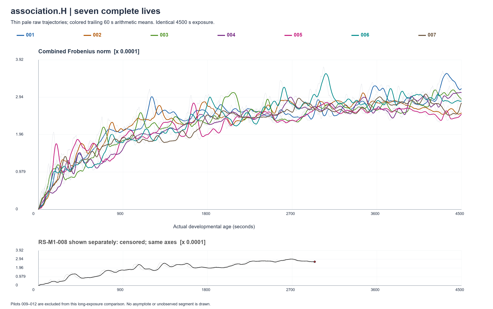
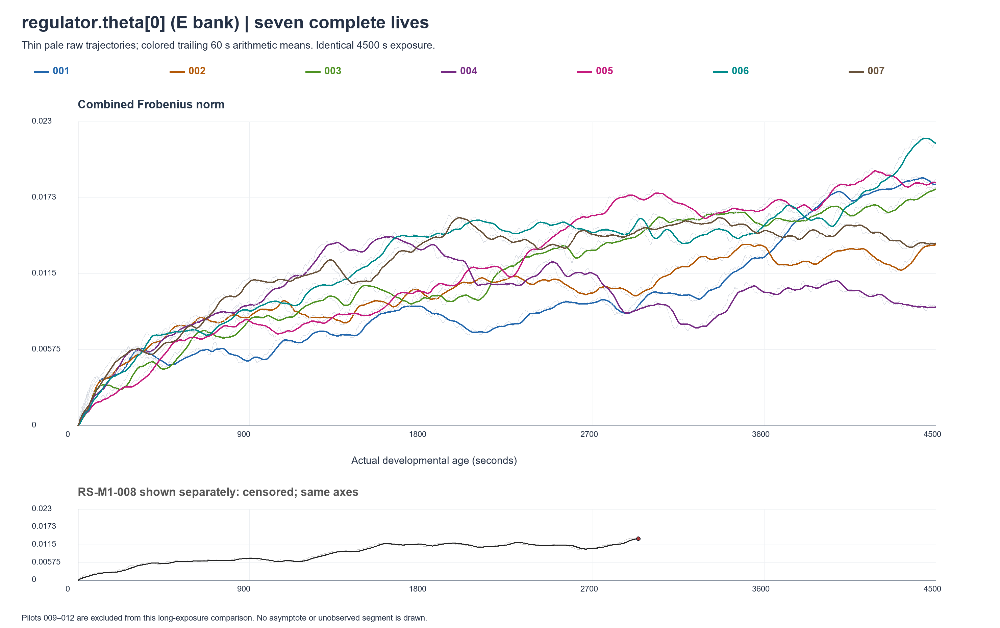
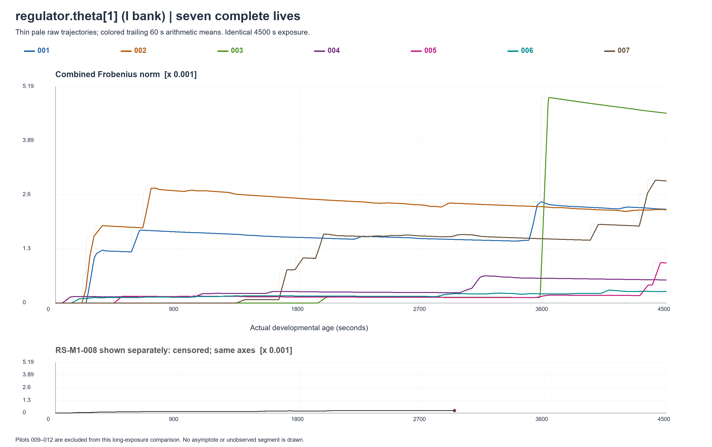
## What was measured and preserved

The exact implementation fields are `association.H`, a dictionary of 56 directed inter-family maps, each with four branches; `regulator.theta[0]`, the E bank; `regulator.theta[1]`, the I bank; `body.energy`; and `body.integrity`. The plotted combined H norm is $\sqrt{\sum_{m,n,j}\|H_{mn,j}\|_F^2}$. Each regulator bank is a 12-by-33 array; its norm is the Frobenius norm of that complete array. A larger norm does not establish better representation, source specificity or beneficial control.

The source wave fields are `map_update_use[:,:4]` (post-write map norms) and `regulator_bank_norm` (post-credit bank norms). H return `q` is the preceding old-map read within the same handoff, before that handoff's write. This ordering matters: the H norm and q in a row belong to different positions in the accepted read/write sequence. No neural function was called to regenerate either one.

The primary series retain every completed 0.2-second wave. Physical E/I exports retain every accepted native record, nominally 0.01 s with genuine fractional boundaries. The original birth norm is zero and is shown explicitly. No sparse matrix state is interpolated. Complete-life final checkpoints have the same norms as their last completed wave; there is no fictitious last wave at exactly 4500 s.

RS-M1-008 is deliberately cut at **2939.9548705459583 s**, its last complete causal checkpoint. Durable native/wave evidence continues to 2968.9548705465913 s, but that later prefix is outside this priority causal-curve display. It remains preserved for the broader physical audit. RS-M1-009–012 stop at 600 s; their overnight stages never started.

Every dark trend line is a **trailing 60-second arithmetic mean of stored samples in (t−60,t]**, shortened near birth. This is a descriptive smoother, not an inferred state. Native body plotting retains chronological first/last/min/max within each horizontal display bin; the compressed CSV retains all native rows. Smoothed E ramps around support are not the instantaneous support jump: the thin raw line and red marker retain that jump. The export and exact support ledger retain both sides.

Red vertical lines mark all external resurrections. Green dots mark the first positive-transfer encounter and later bouts transferring at least 0.02 E; red dots mark contact episodes causing at least 0.002 damage; purple dots mark at least 0.0001 repair. These fixed **display thresholds** avoid hiding the curves, are not competence criteria, and do not exclude lesser events from the preserved evidence. This priority display uses the previous report's one-second time-grouped source bouts. The broader geometry/time sensitivity analysis is a separate task. Marker overlap is not proof of causation.

## Local slopes: measured shape, not endpoint inference

The slope estimator is Theil–Sen applied to non-overlapping 5-second medians within each fixed window. It is robust to isolated spikes. We also export ordinary least-squares slopes, the first/last 60-second median difference, the within-window range and residual MAD. The full table includes 300 s and 600 s windows, early/middle/late bands and the final 1000 s where available. There are no significance tests or fitted significance thresholds.

For the seven complete lives, early is 0–1000 s, middle is 1750–2750 s and late is 3500–4500 s. For pilots, early/middle/late are their three 200 s thirds. The censored life uses bounded third-length early/middle bands and a separate final-1000 band. Do not compare a pilot slope as though it had 4500 s of exposure.

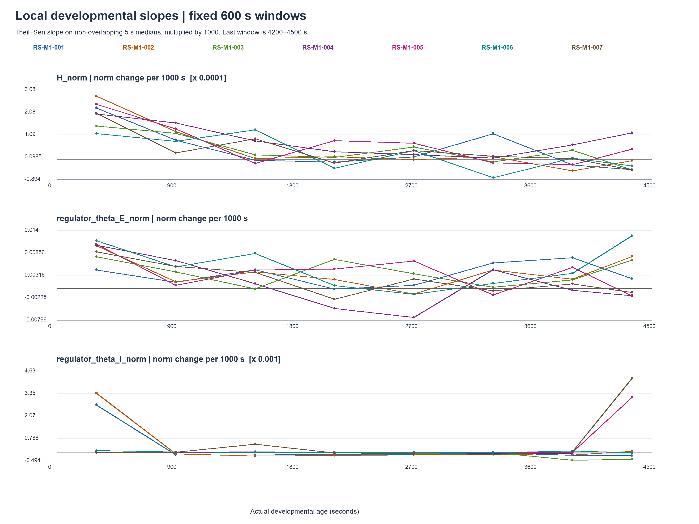

### Final 1000 s of complete lives

Numbers are robust predicted **norm change per 1000 s**, followed by that change as a percentage of the late median norm. Percentages measure relative structural change, not skill.

| Life | H | E bank | I bank |
|---|---:|---:|---:|
| 001 | +1.859e-05 (+6.4%) | +0.005455 (+31.3%) | -0.00015 (-6.5%) |
| 002 | -3.89e-05 (-14.6%) | +0.0002914 (+2.3%) | -0.000101 (-4.5%) |
| 003 | +4.817e-05 (+17.3%) | +0.002406 (+14.9%) | -0.0004345 (-9.2%) |
| 004 | +5.449e-05 (+19.6%) | -0.001726 (-17.1%) | -4.505e-05 (-7.8%) |
| 005 | -2.567e-05 (-10.0%) | +0.002749 (+15.2%) | -1.177e-05 (-6.3%) |
| 006 | -3.523e-07 (-0.1%) | +0.00745 (+44.4%) | +6.764e-05 (+29.3%) |
| 007 | -2.184e-05 (-7.9%) | -0.0008487 (-5.9%) | +0.0008519 (+46.0%) |

H has positive final-1000 slopes in 001/003/004, negative slopes in 002/005/007, and a near-zero slope in 006. The positive H slope in 001 is small beside its local fluctuations; it is not a uniform sustained rise. E has substantial positive late structural change in 001/003/005/006; 002 is comparatively level, and 004/007 decline. “More time” remains a possible explanation for incomplete E development in some organisms, not a general conclusion about all organisms or useful behavior.

I requires special care. Its robust late slope is negative in five lives and positive in two, **yet 005 has a large very late positive step**. The median-slope estimator follows the long preceding decay and must not erase that event. Similarly, 003 has a large late jump followed by decay. The raw curves, fixed-window slopes and [largest-increment catalog](tables/EVENT_STEP_CATALOG.csv) preserve these differences. A negative background slope is not evidence that no new learning event occurred.

[All local/late slopes](tables/LOCAL_AND_LATE_SLOPES.csv).

## Small descriptive model comparison

The candidate forms are $y=a+bt$, $y=A-B\exp(-t/\tau)$, and $y=a+bt^p$. Fits use non-overlapping 60-second medians, a robust soft-L1 loss and no prediction of unseen physical outcomes. Exponential and power growth amplitudes and their implied birth levels are nonnegative. Exponential τ is bounded to 1–1,000,000 s and power p to 0.05–3 for numerical identification; bound-hitting estimates are flagged, not treated as findings. Parameters in the CSV use actual seconds. Each form is fitted to 0–4500 s and again after excluding 0–600 s.

These smooth monotonic candidates are **not adequate descriptions of pronounced reversals or stepwise I histories**. Their numerical results are retained as diagnostic failures rather than forcing such lives into a growth category. RMSE, MAE, R², lag-1 residual correlation and early/late residual means are exported. A high R² across a wide birth-to-late range can coexist with systematically wrong late behavior.

### H

| Life | Best full-interval descriptive RMSE | R² | Residual lag-1 | Exp τ: full / omit 600 s | Exp A: full / omit 600 s |
|---|---|---:|---:|---:|---:|
| 001 | saturating exponential (2.328e-05) | 0.863 | 0.712 | 685.3 / 7.568e+05 | 0.0002767 / 0.0174 |
| 002 | saturating exponential (1.627e-05) | 0.919 | 0.562 | 604.9 / 784.6 | 0.0002694 / 0.0002729 |
| 003 | saturating exponential (2.094e-05) | 0.885 | 0.504 | 975.3 / 2738 | 0.0002783 / 0.0003176 |
| 004 | saturating exponential (1.51e-05) | 0.949 | 0.33 | 1107 / 1016 | 0.0002851 / 0.0002827 |
| 005 | saturating exponential (2.182e-05) | 0.827 | 0.331 | 957.3 / 824.3 | 0.0002591 / 0.0002586 |
| 006 | saturating exponential (1.938e-05) | 0.924 | 0.504 | 1232 / 1226 | 0.0003017 / 0.0003014 |
| 007 | saturating exponential (1.531e-05) | 0.936 | 0.604 | 1252 / 1794 | 0.0002833 / 0.0002984 |

For H, the exponential envelope has the lowest full-interval RMSE of these candidates in all seven lives; full-fit τ is roughly 605–1252 s and A roughly 0.000259–0.000302. That describes broad concavity, not a demonstrated fixed ceiling. Residual autocorrelation remains about 0.33–0.71. Excluding the first 600 s changes 001's τ from about 685 s to about 757,000 s, and 003's from 975 to 2738 s. The late data do not independently identify the proposed asymptote in those lives. 004/005/006 are more stable under that exclusion; 002/007 remain broadly concave-down but still have reversals. Even a stable envelope cannot guarantee a plateau under a changed experience distribution.

### E bank

| Life | Best full-interval descriptive RMSE | R² | Residual lag-1 | Exp τ: full / omit 600 s | Exp A: full / omit 600 s |
|---|---|---:|---:|---:|---:|
| 001 | power (0.001131) | 0.932 | 0.896 | 5.675e+05 / 4.267e+05 | 1.715 / 1.392 |
| 002 | power (0.0007121) | 0.924 | 0.787 | 1999 / 8250 | 0.01396 / 0.0228 |
| 003 | power (0.000729) | 0.971 | 0.791 | 3209 / 4951 | 0.02214 / 0.02674 |
| 004 | saturating exponential (0.001682) | 0.581 | 0.946 | 377.1 / 340.4 | 0.0106 / 0.01055 |
| 005 | saturating exponential (0.001024) | 0.959 | 0.908 | 3998 / 4322 | 0.0275 / 0.02869 |
| 006 | power (0.001334) | 0.905 | 0.933 | 1431 / 1204 | 0.01764 / 0.01712 |
| 007 | saturating exponential (0.0007131) | 0.954 | 0.774 | 849.1 / 757 | 0.01493 / 0.01482 |

There is no common saturating E trajectory. The enormous τ/A estimates for 001 are effectively an unidentifiable long-timescale rise, not an estimate of future capacity. Excluding the first 600 s moves 002's τ from roughly 1999 to 8250 s. 003/005 support slower continuing growth. 004 and 007 are better described as rise followed by oscillation/decline than as steady progress toward a known ceiling. 006's renewed late growth is visibly missed by a single whole-life exponential. Residual serial structure is strong across the E models (roughly 0.77–0.95 for the lowest-RMSE candidates), so none licenses extrapolation.

### I bank

| Life | Best full-interval descriptive RMSE | R² | Residual lag-1 | Exp τ: full / omit 600 s | Exp A: full / omit 600 s |
|---|---|---:|---:|---:|---:|
| 001 | saturating exponential (0.000339) | 0.557 | 0.88 | 303.6 / 4.699e+05 | 0.001705 / 0.0956 |
| 002 | saturating exponential (0.0002432) | 0.805 | 0.786 | 281.6 / 2.767e+05 | 0.002409 / 0.002401 |
| 003 | power (0.0009526) | 0.74 | 0.908 | 1e+06 / 1e+06 | 0.2126 / 0.215 |
| 004 | power (7.959e-05) | 0.807 | 0.882 | 5.361e+05 / 3.885e+05 | 0.06507 / 0.05067 |
| 005 | linear (0.0001342) | 0.143 | 0.854 | 447.4 / 1e+06 | 0.0001615 / 0.01178 |
| 006 | linear (2.679e-05) | 0.772 | 0.759 | 9.029e+05 / 5.252e+05 | 0.03153 / 0.01759 |
| 007 | linear (0.0003646) | 0.811 | 0.914 | 6.036e+05 / 2.798e+04 | 0.2946 / 0.01453 |

I is event-driven. Some whole-life fits mainly explain when a large damage-associated increase occurred. Excluding early steps can move fitted τ by orders of magnitude or make R² negative. 003 reaches the artificial τ search ceiling; that is failed identification, not a million-second learning timescale. Smooth-model asymptotes are not scientifically interpretable for these step-and-decay curves.

The exponential profile table also records τ values within 10% of the minimum least-squares RMSE on a fixed logarithmic grid. This is a **sensitivity band, not a confidence interval**. A broad band, a large τ, strong residual structure or unstable A/τ after excluding the first 600 s means the observed late data do not constrain a useful asymptote.

[Complete fit table](tables/SHAPE_MODEL_COMPARISON.csv), including all 126 fits. [H residual figure](figures/MODEL_RESIDUALS_H_norm.png), [E residual figure](figures/MODEL_RESIDUALS_regulator_theta_E_norm.png), [I residual figure](figures/MODEL_RESIDUALS_regulator_theta_I_norm.png).

## Structural growth versus functional expression

`H_use_mean` is the arithmetic mean of the 224 stored branch-use statistics; it is not a success fraction. `q_norm` is the norm of the stored associative return. Learned E/I current effects are **intact minus that bank's learned contribution omitted**, at the same recorded exploration draws, need values and other bank. The outer tanh is retained. These exact algebraic receiver effects are not counterfactual movements. The spontaneous comparator is paired M1 RMS at recorded wave motor diagnostics; it precedes the new outgoing regulator controls at that handoff, so the ratio is a scale comparison, not an additive simultaneous trajectory decomposition.

| Life | E effect / M1, early → late | I effect / M1, early → late | q RMS, early → late | Mean H use, early → late |
|---|---:|---:|---:|---:|
| 001 | 0.177% → 1.151% | 0.026% → 0.079% | 1.29e-05 → 2.65e-05 | 1.82e-11 → 7.63e-11 |
| 002 | 0.280% → 0.806% | 0.034% → 0.046% | 1.36e-05 → 2.03e-05 | 1.93e-11 → 4.74e-11 |
| 003 | 0.365% → 1.111% | 0.000% → 0.138% | 1.18e-05 → 2.24e-05 | 1.48e-11 → 5.63e-11 |
| 004 | 0.228% → 0.501% | 0.002% → 0.005% | 1.07e-05 → 2.34e-05 | 1.1e-11 → 6.08e-11 |
| 005 | 0.410% → 0.563% | 0.001% → 0.006% | 1.19e-05 → 1.88e-05 | 1.44e-11 → 3.98e-11 |
| 006 | 0.172% → 0.218% | 0.001% → 0.006% | 1.08e-05 → 2.33e-05 | 1.27e-11 → 6.09e-11 |
| 007 | 0.141% → 0.485% | 0.000% → 0.044% | 1.09e-05 → 2.22e-05 | 1.28e-11 → 5.46e-11 |

Both q and mean H-use generally rise from the early to late windows; neither is literally flat. **Their absolute scale remains tiny**: late mean use is approximately 4.0×10⁻¹¹–7.6×10⁻¹¹, with q RMS around 1.9×10⁻⁵–2.6×10⁻⁵. The use update is driven by squared branch return divided by 0.01 plus that power; tiny return therefore produces extremely weak use protection. Structural growth accompanied by tiny functional reading is consistent with case E in the request, but the curves alone do not prove that useful associations are being erased.

Late learned-E current effects are approximately **0.22–1.15% of M1 RMS**; learned-I effects are approximately **0.005–0.138%**. These effects increase from early to late for all seven complete lives, but their size remains small. The stored local target sensitivity remains nonzero, so this is not evidence of an entirely blocked receiver. Nor does a nonzero immediate effect establish useful physical control. RS-M1-006 is especially informative: a large late E-bank increase accompanies comparatively weak E-current expression. That makes expression a question to examine, not a diagnosed bottleneck from norm alone.

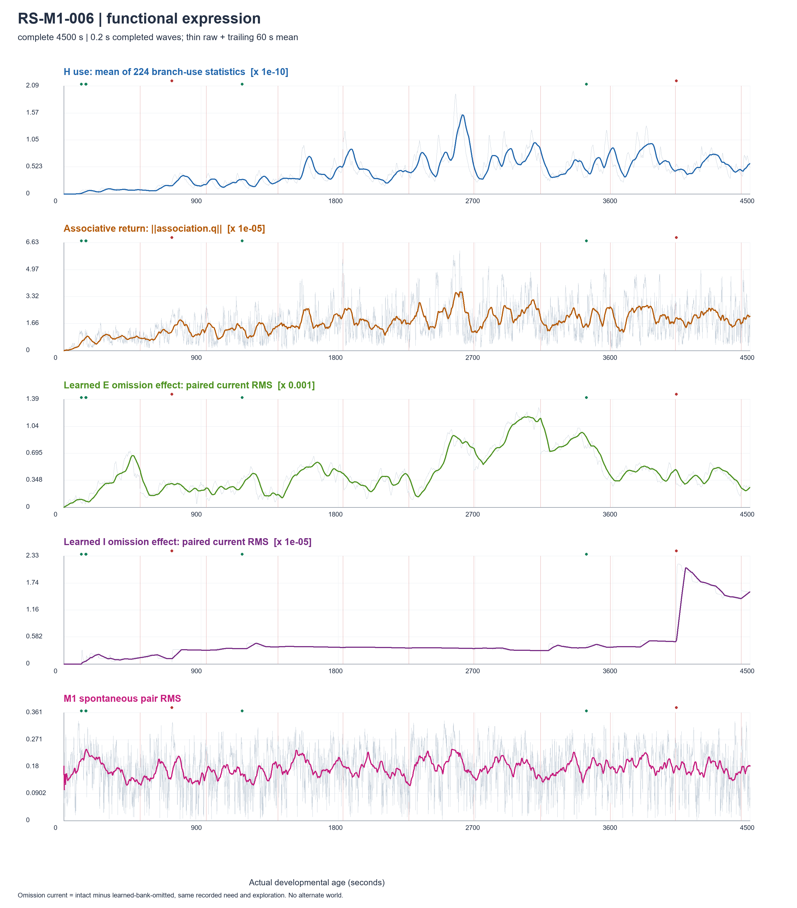

[Functional age-band table](tables/FUNCTIONAL_READOUT_BY_AGE.csv). Each organism has its own supplementary five-panel functional figure in the viewer and figure directory.

## Individual curves and bounded readings

### RS-M1-001 — observed through 4500.000000 s

**H:** H has early rise, long noisy middle, then several late excursions; its final-1000 slope is small relative to local fluctuations.

**E bank:** E grows through several phases and rises faster late than early. It is not near an established ceiling.

**I bank:** I has discrete early and late increases, followed by reference-driven decline. The late robust slope describes the decline, not absence of learning.

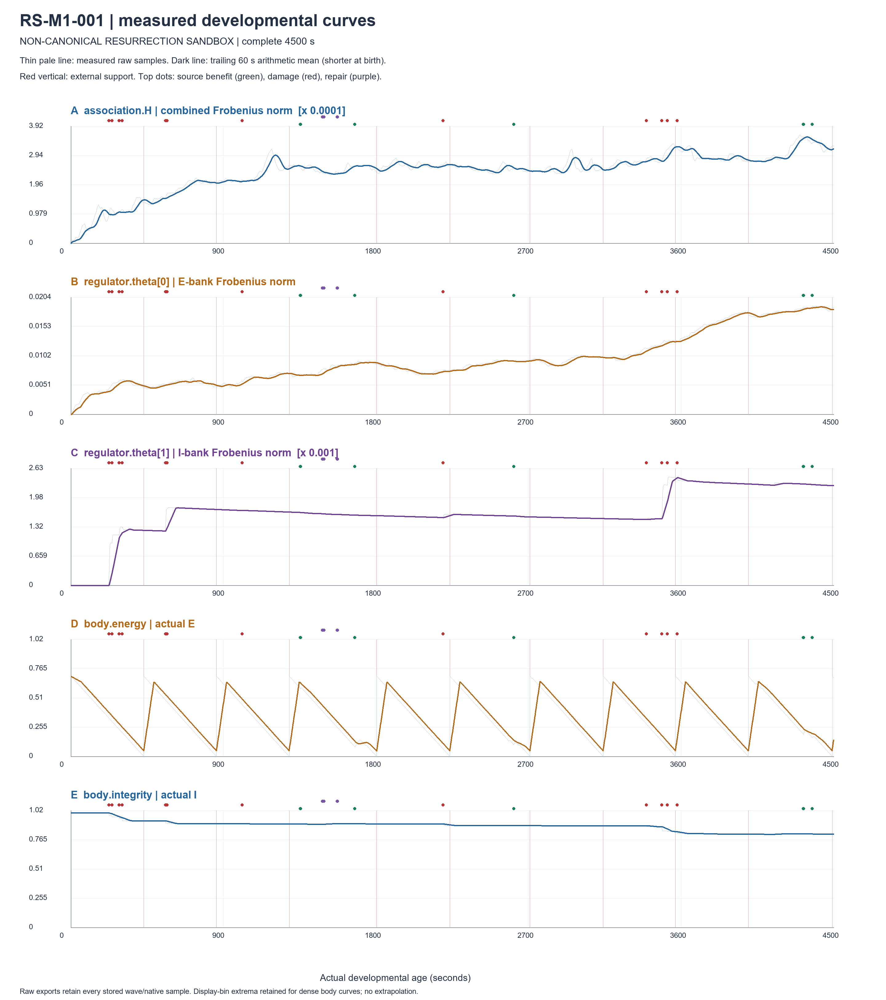

[Functional readouts](figures/RS-M1-001_FUNCTIONAL.png) · [raw wave CSV, gzip](raw/RS-M1-001_H_E_I_WAVES.csv.gz) · [native body CSV, gzip](raw/RS-M1-001_BODY_NATIVE.csv.gz)

### RS-M1-002 — observed through 4500.000000 s

**H:** H rises early and is lower late; a concave-down envelope is plausible, with appreciable reversals.

**E bank:** E is irregular and nearly level over the final 1000 s despite some late recovery.

**I bank:** I grows in early steps and mostly fades thereafter, with smaller later events.

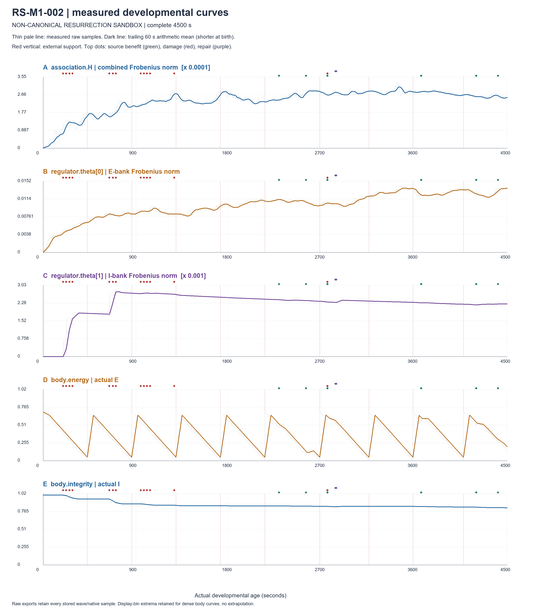

[Functional readouts](figures/RS-M1-002_FUNCTIONAL.png) · [raw wave CSV, gzip](raw/RS-M1-002_H_E_I_WAVES.csv.gz) · [native body CSV, gzip](raw/RS-M1-002_BODY_NATIVE.csv.gz)

### RS-M1-003 — observed through 4500.000000 s

**H:** H has alternating increases and declines, including a positive late trend; a single plateau misses those phases.

**E bank:** E remains positively developmental late, with slower rise than early.

**I bank:** I has a conspicuous late jump followed by decay. A smooth monotonic curve does not describe this history.

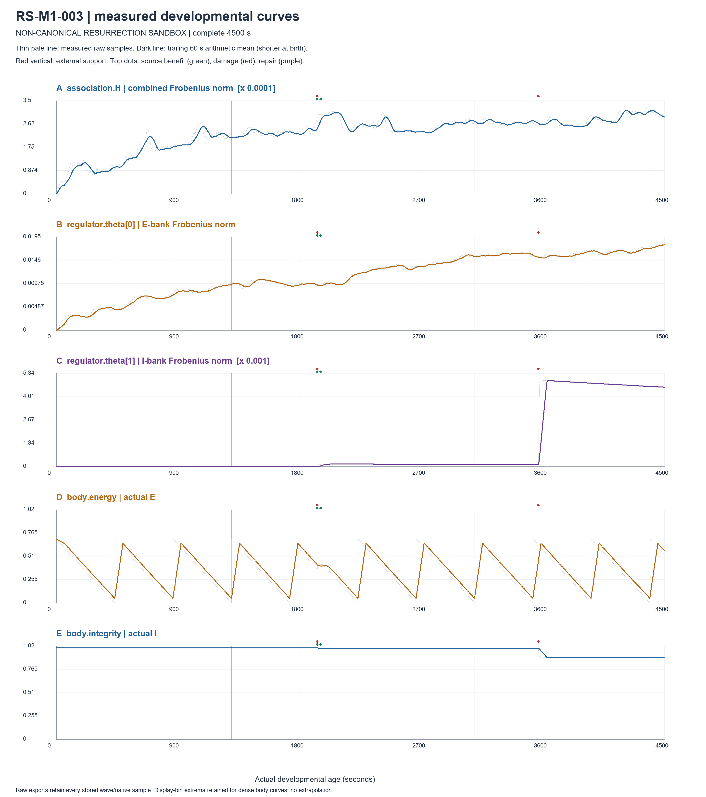

[Functional readouts](figures/RS-M1-003_FUNCTIONAL.png) · [raw wave CSV, gzip](raw/RS-M1-003_H_E_I_WAVES.csv.gz) · [native body CSV, gzip](raw/RS-M1-003_BODY_NATIVE.csv.gz)

### RS-M1-004 — observed through 4500.000000 s

**H:** H has a fairly stable decelerating overall envelope but rises again late.

**E bank:** E peaks early, oscillates and declines late. Saturation is not a sufficient description of the reversal.

**I bank:** I accumulates in occasional steps separated by fading intervals.

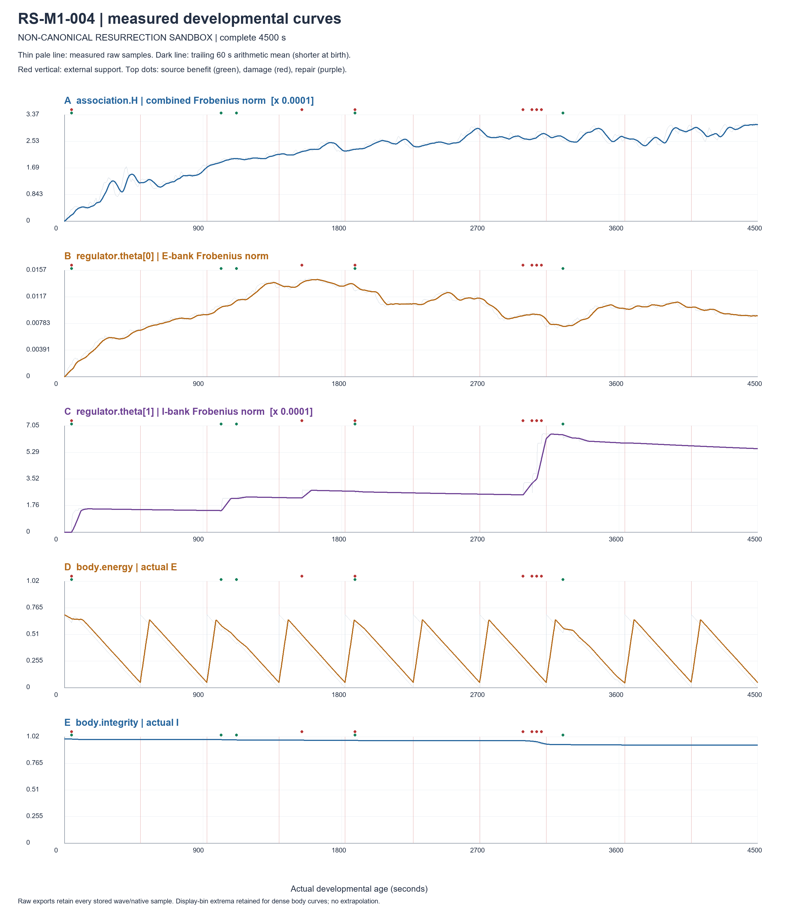

[Functional readouts](figures/RS-M1-004_FUNCTIONAL.png) · [raw wave CSV, gzip](raw/RS-M1-004_H_E_I_WAVES.csv.gz) · [native body CSV, gzip](raw/RS-M1-004_BODY_NATIVE.csv.gz)

### RS-M1-005 — observed through 4500.000000 s

**H:** H broadly levels after early growth, with late decline and fluctuations.

**E bank:** E continues rising late at a reduced background rate; it has not demonstrated a stable asymptote.

**I bank:** I has a very late upward step after a long low-level history. The final-1000 robust slope is negative because it follows the long background decay; the raw step must not be averaged away.

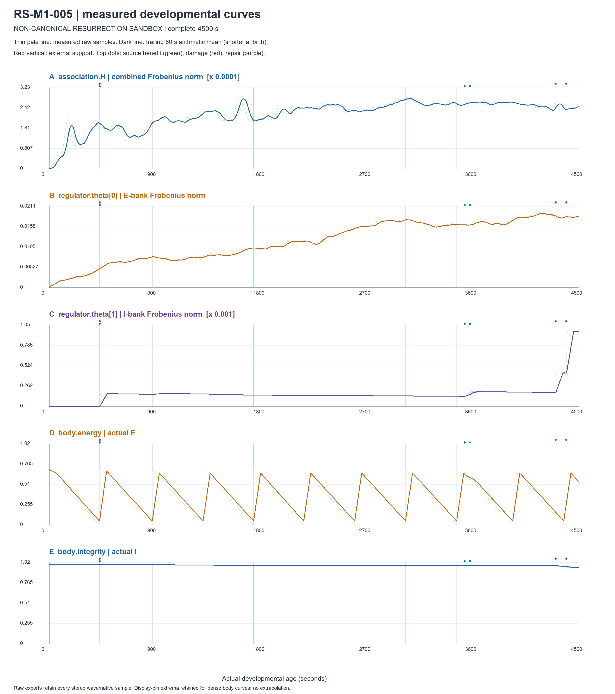

[Functional readouts](figures/RS-M1-005_FUNCTIONAL.png) · [raw wave CSV, gzip](raw/RS-M1-005_H_E_I_WAVES.csv.gz) · [native body CSV, gzip](raw/RS-M1-005_BODY_NATIVE.csv.gz)

### RS-M1-006 — observed through 4500.000000 s

**H:** H approaches a fluctuating band and is nearly flat on the final-1000 robust slope, although earlier late excursions remain visible.

**E bank:** E shows renewed strong late growth after a long slower phase. A whole-life exponential understates this renewed development.

**I bank:** I has small event-linked increases; the late trend is positive at a small absolute magnitude.

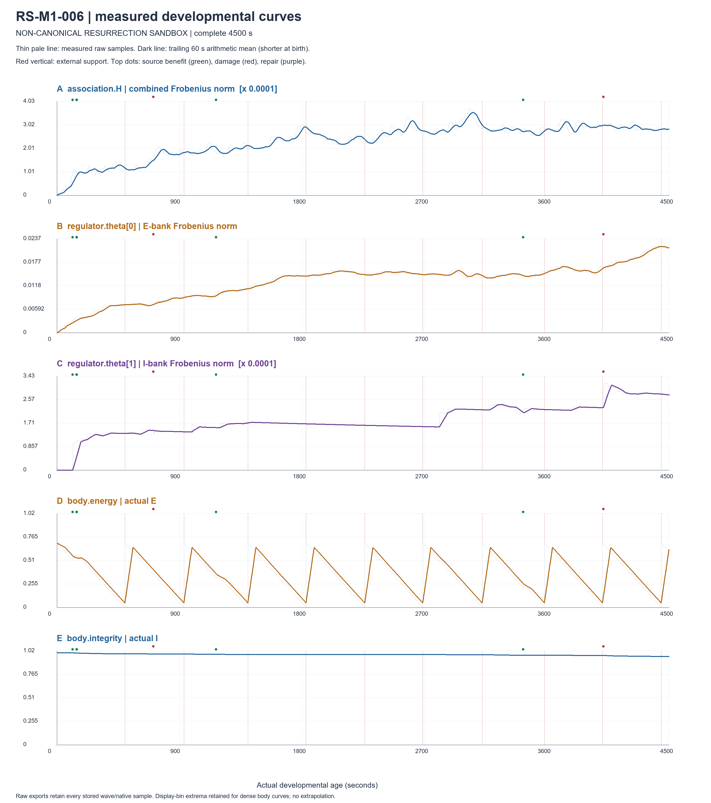

[Functional readouts](figures/RS-M1-006_FUNCTIONAL.png) · [raw wave CSV, gzip](raw/RS-M1-006_H_E_I_WAVES.csv.gz) · [native body CSV, gzip](raw/RS-M1-006_BODY_NATIVE.csv.gz)

### RS-M1-007 — observed through 4500.000000 s

**H:** H has a decelerating envelope with a negative late background trend.

**E bank:** E rises early, then oscillates around a broad level and declines slightly late.

**I bank:** I remains strongly event-shaped and has a large very late rise.

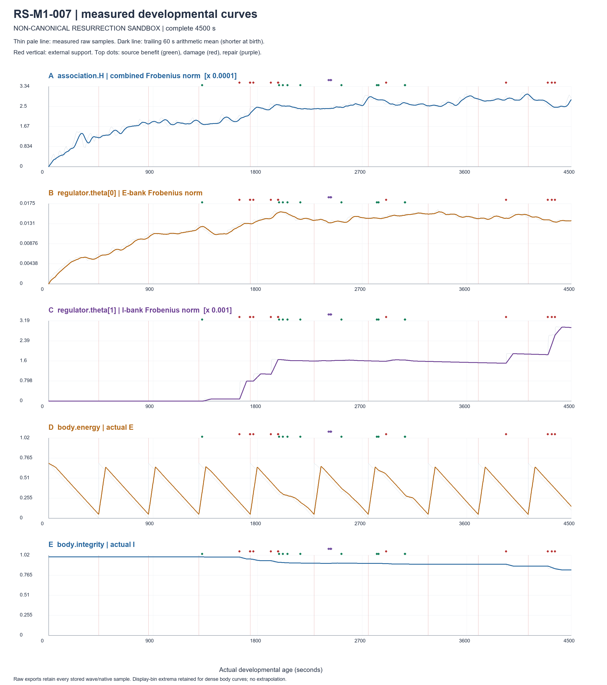

[Functional readouts](figures/RS-M1-007_FUNCTIONAL.png) · [raw wave CSV, gzip](raw/RS-M1-007_H_E_I_WAVES.csv.gz) · [native body CSV, gzip](raw/RS-M1-007_BODY_NATIVE.csv.gz)

### RS-M1-008 — observed through 2939.954871 s

**H:** H rises again before its last complete checkpoint.

**E bank:** E is nearly flat on its final-1000 robust trend but recovers near the cutoff.

**I bank:** I is small and mostly declining late. No claim is made about its unobserved future.

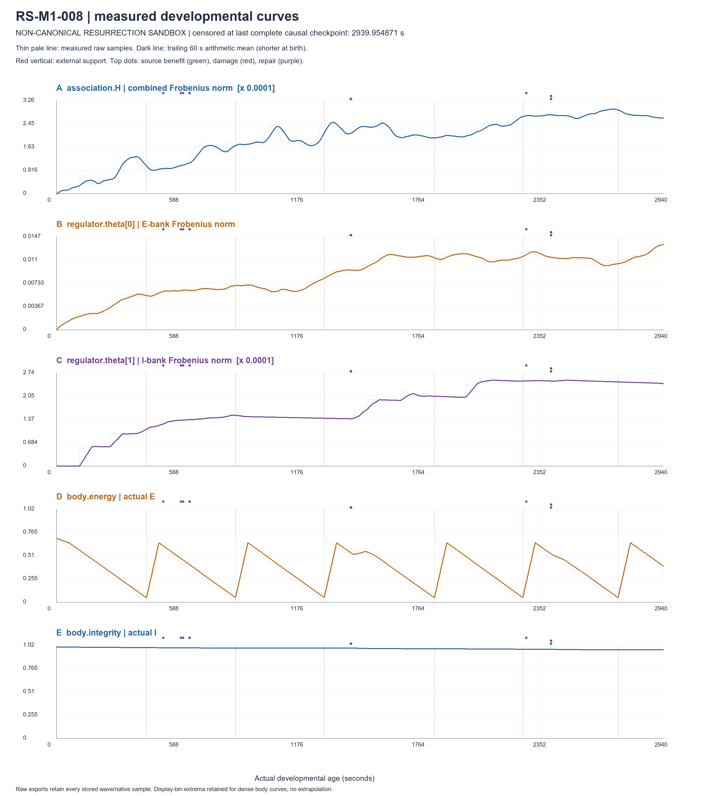

[Functional readouts](figures/RS-M1-008_FUNCTIONAL.png) · [raw wave CSV, gzip](raw/RS-M1-008_H_E_I_WAVES.csv.gz) · [native body CSV, gzip](raw/RS-M1-008_BODY_NATIVE.csv.gz)

### RS-M1-009 — observed through 600.000000 s

**H:** H grows then becomes much slower within the pilot.

**E bank:** E rises early and is almost flat/slightly falling late in this short history.

**I bank:** I begins to increase late in the pilot.

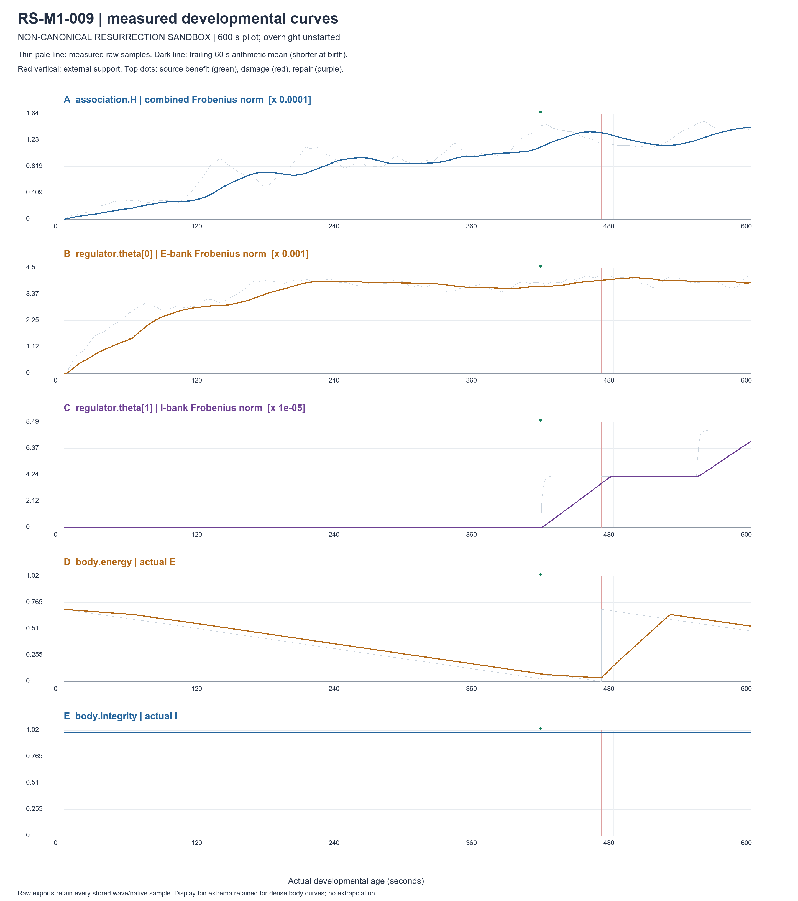

[Functional readouts](figures/RS-M1-009_FUNCTIONAL.png) · [raw wave CSV, gzip](raw/RS-M1-009_H_E_I_WAVES.csv.gz) · [native body CSV, gzip](raw/RS-M1-009_BODY_NATIVE.csv.gz)

### RS-M1-010 — observed through 600.000000 s

**H:** H continues rising in the pilot.

**E bank:** E continues rising in the pilot.

**I bank:** I remains exactly zero throughout the measured pilot; the preserved physical record has no damage or repair.

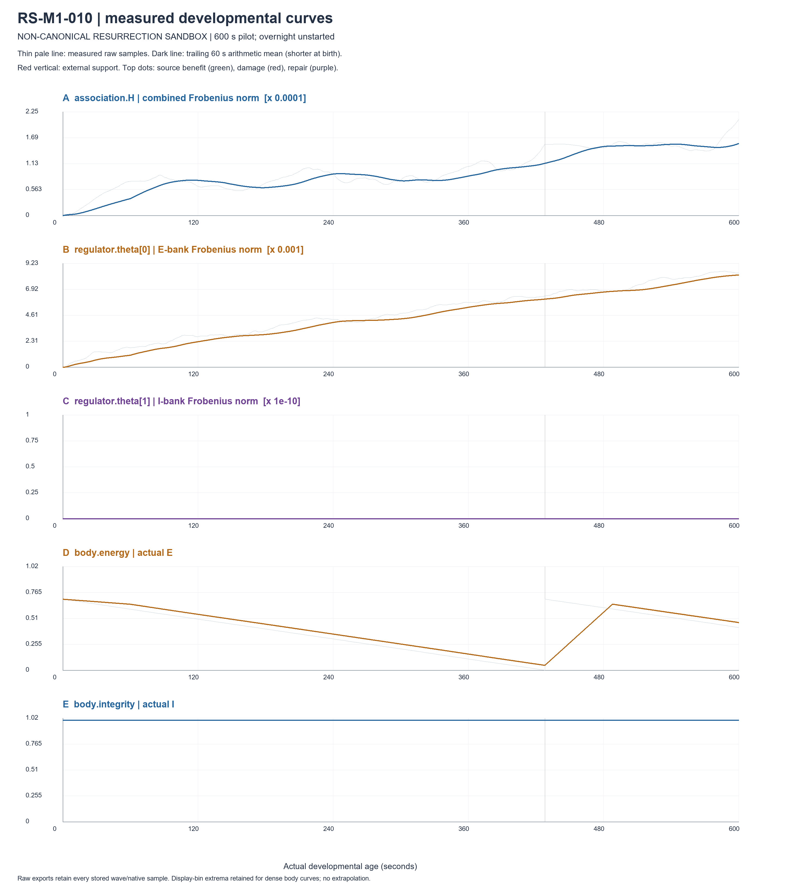

[Functional readouts](figures/RS-M1-010_FUNCTIONAL.png) · [raw wave CSV, gzip](raw/RS-M1-010_H_E_I_WAVES.csv.gz) · [native body CSV, gzip](raw/RS-M1-010_BODY_NATIVE.csv.gz)

### RS-M1-011 — observed through 600.000000 s

**H:** H continues rising across the pilot.

**E bank:** E continues rising across the pilot.

**I bank:** I has late event-linked growth.

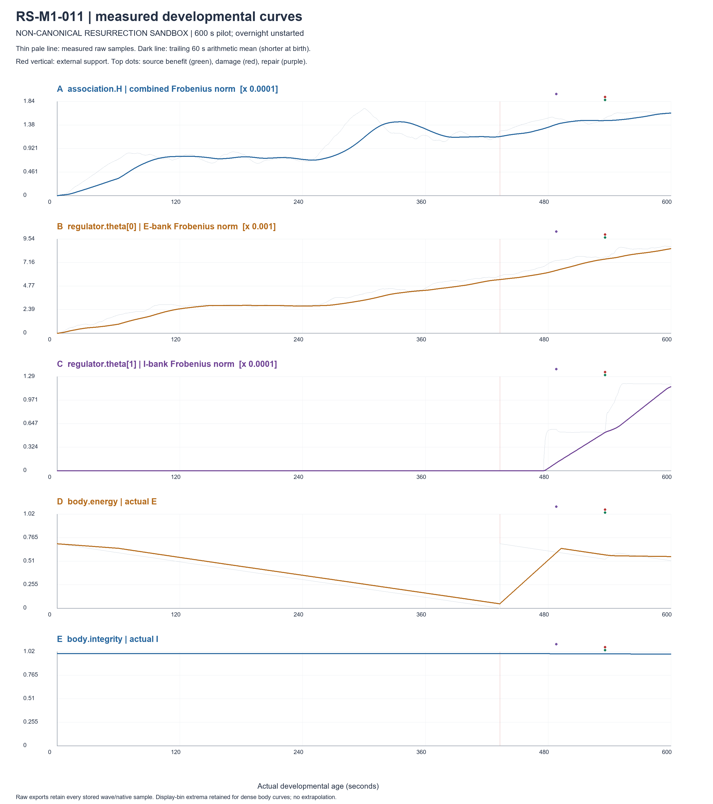

[Functional readouts](figures/RS-M1-011_FUNCTIONAL.png) · [raw wave CSV, gzip](raw/RS-M1-011_H_E_I_WAVES.csv.gz) · [native body CSV, gzip](raw/RS-M1-011_BODY_NATIVE.csv.gz)

### RS-M1-012 — observed through 600.000000 s

**H:** H grows strongly then declines before 600 s.

**E bank:** E grows earlier and slows late.

**I bank:** I grows early and then fades.

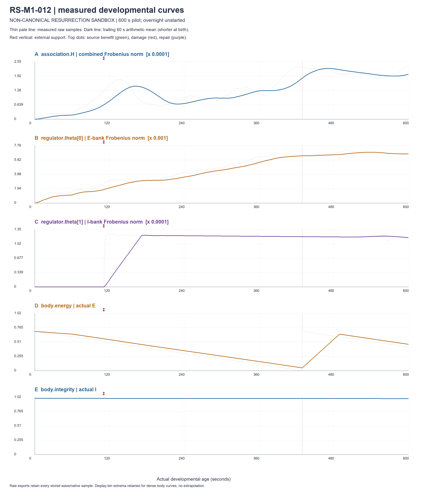

[Functional readouts](figures/RS-M1-012_FUNCTIONAL.png) · [raw wave CSV, gzip](raw/RS-M1-012_H_E_I_WAVES.csv.gz) · [native body CSV, gzip](raw/RS-M1-012_BODY_NATIVE.csv.gz)

## Provenance and consistency review

The source experiment is the non-canonical M1 resurrection sandbox, runtime `752b7c335347a5f55fd3e7cdf1b904137d41e5b229b8ea2252caa8e12a455f3c`, under corrected apparatus checkpoint `1d7cd6fd450ea528562b2c825589ab4de18a5b38`, with historical P identity `6bc9683b54e4fa80136fe8534d7713e2a250a95f`. The exact sandbox, M1, configuration and P source hashes are verified against the prepared runtime record.

The original archive is unchanged: **4,653,285,580 bytes**, SHA-256 `a165c5c48e4b9ed6a84a8ba02b7b1bc23ca57f43f38bfe6d0058694969e7e651`. All **37,909 sealed execution files** were rehashed, totaling 4,258,393,873 bytes. The source manifest lists each relative evidence path and exact hash; the review package includes that manifest, not a duplicate of the experiment archive.

An independently coded calculation path recomputed all three norms directly from **807 full checkpoints** and matched the per-wave extraction with maximum absolute error **5.421010862427522×10⁻²⁰**. The extraction also matches the preserved earlier wave history, and every exported native E/I row matches its decoded source value. The priority CSVs contain **184,156 measured waves** and **3,684,048 native body rows plus birth rows**. The difference from the full durable prefix is the explicitly excluded final 29 seconds of RS-M1-008. Physical ledger checks agree with the previous totals. This is a consistency review by the same analyst using independent calculation paths, **not an external or second-person scientific review**.

[Input provenance](INPUT_PROVENANCE.json), [exact evidence manifest](EXECUTION_EVIDENCE_HASHES.json), [source verification](SOURCE_IDENTITY_VERIFICATION.json), [curve consistency review](CURVE_CONSISTENCY_REVIEW.json), [extraction verification](EXTRACTION_VERIFICATION.json).

No simulation, no P invocation, no RNG draw, no checkpoint continuation, no alternate history, no RS-M1-008 retry, no parameter or canonical-code change occurred. All analysis code and derivative files are separate from the preserved evidence. This priority report does not claim completion of the broader developmental causal-chain analysis.

## At the end of the available observation window

**H:** strongly decelerated from birth, generally fluctuating around a broad band; some lives still rise late and others decline. A universal stable asymptote is not established.

**Learned E (`regulator.theta[0]`):** still developmental in several organisms, with continuing or renewed growth; other organisms level, oscillate or decline. It is neither uniformly linear nor uniformly saturated. More time remains a candidate for some structural changes, without evidence that time alone would yield useful control.

**Learned I (`regulator.theta[1]`):** predominantly event-driven, with abrupt increases and intervening decay. Recent large steps can coexist with a negative robust background slope. A smooth saturation claim would be misleading.

**Expression:** learned current, q and use do increase, but remain small in the implemented receiver. Norm growth is not equivalent to useful learning.
