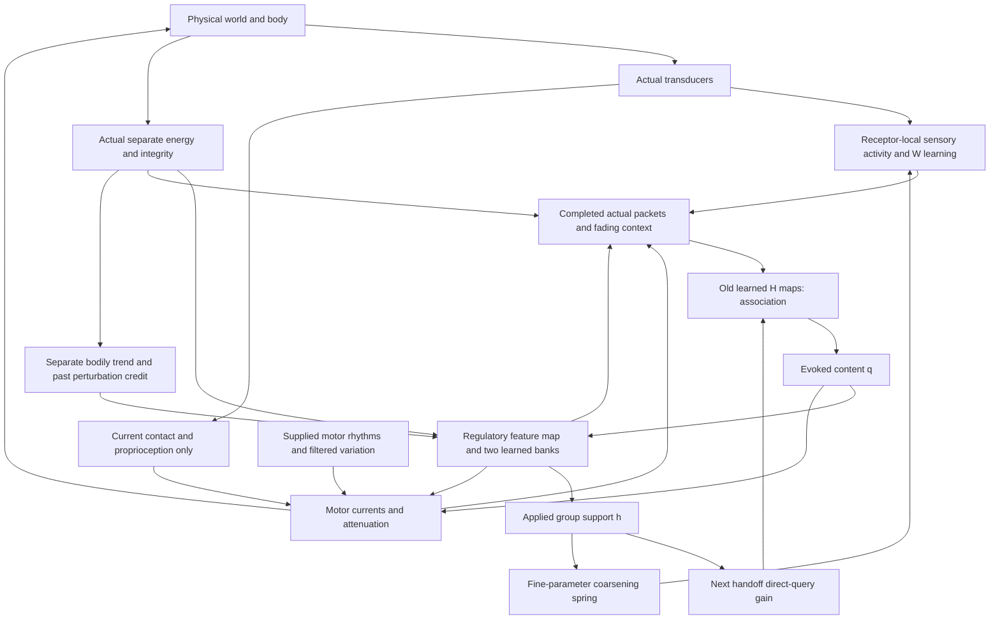

# P plain-language data flow v0.1

This describes the same proposed system as [P's implementation and observation specification](P_IMPLEMENTATION_AND_OBSERVATION_SPEC_v0_1_REVIEW_DRAFT.md). It is intended to make every important operation inspectable before anything is built. Jason has selected P for specification and permitted its narrowly bounded bodily-learning scaffold; the proposed numbers and engineering completions still await review. Neither the prose nor the equations promise useful development.

The exact parent, authority and source identities are in the [specification, sections 1 and 14](P_IMPLEMENTATION_AND_OBSERVATION_SPEC_v0_1_REVIEW_DRAFT.md#1-authority-parent-and-classification), [decision record](../../40_DECISIONS/DECISION-P-SPECIFICATION-2026-09-20-83a00674.md) and [source identities](SOURCE_IDENTITIES.json). The [full original P](../../90_SOURCES/p_specification_authority_2026-09-20_83a00674/exact_parent/LOOM_ASSOCIATIVE_REGULATORY_CANDIDATE_v0_1_DISCUSSION_DRAFT.md) is the parent; R supplies no added packet, input, learning rule or arbitration mechanism.

## 1. The continuing loop

The proposed world has light, two lingering chemical fields, walls, renewable sources, restorative surfaces and a moving block. The organism has a small oriented body, two actuators and two real needs. Energy is spent continuously; stress can reduce integrity. Only real source exchange replenishes energy and actual gentle restorative contact replenishes integrity.

The following arrows are data routes. They do not mean that the recipient understands what the signal describes.

The observer can inspect world truth, equations and saved state. It does not send a “good outcome,” source name, right action, reward score or successful-contact label down these arrows.

### 1.1 What actually arrives

At every proposed hundredth of a second, the body provides ten forward light intensities, four chemical-mixture readings, eight contact-load readings and seven proprioceptive readings. Proprioception includes the commands delivered to the actuators, the movement that actually occurred and fixed discrepancies between command and motion. It contains no global position or planned path.

The simulator uses geometry, materials and stocks to calculate these readings, but the organism receives only the declared numbers. Five light sectors are anatomical receptive fields, not five object detectors. Chemical sensitivities overlap. A familiar source can be depleted while remaining visually present, and its earlier chemical emissions can still be in the world.

Energy and integrity also arrive as separate actual readings. These remain available to the regulatory and bodily-learning interface. They are not replaced by recalled reserves. The source formulas and every transducer are specified in [specification section 8](P_IMPLEMENTATION_AND_OBSERVATION_SPEC_v0_1_REVIEW_DRAFT.md#8-proposed-body-and-accepted-base-world-realization).

### 1.2 What a sensory cortex does to its own input

Each learned sensory channel has eight units and its own learned sensitivity matrix. First, a running mean follows its raw readings. The channel subtracts that mean. It then updates activity by mixing this receptor residual through its learned weights, adding a small fixed recurrent contribution from its previous activity, applying a bounded nonlinearity and allowing the activity to relax toward that result.

The fixed recurrence supplies some immediate history dependence; it is not a learned recurrent intelligence. Receptor adaptation, current activity and lasting weights are three different things. Their exact operations are [P equation 1 and specification section 3](P_IMPLEMENTATION_AND_OBSERVATION_SPEC_v0_1_REVIEW_DRAFT.md#3-native-sensory-processing-and-packets).

At the same native rhythm, a specified Oja-type local pressure combines current receptor residual, current cortical activity, existing sensory weights and a running coactivity estimate. A competition term discourages duplicated activity-dependent sensitivities. It does not compare the cortex with a correct visual representation, predict the next state or receive a bodily score. The pressure can favour nuisance variation.

That pressure is only one part of actual weight change. Shared rows move slowly; fine residuals have their own local formation term, a coarsening spring and a pull toward slow references. Group support changes the spring's strength. It does not supply the desired value or sign of a sensory feature. See [P equations 3, 15–16 and specification section 6](P_IMPLEMENTATION_AND_OBSERVATION_SPEC_v0_1_REVIEW_DRAFT.md#6-sensory-retention-and-ongoing-motor-output).

### 1.3 What is handed to association

Every proposed 0.2 seconds, each sensory cortex emits its mean activity over the interval plus its endpoint activity. Activity itself continues; the mean accumulator turns over. This is a limited summary of an evolving response, not an addressable episode, a raw photograph or a promise to preserve every important ordering.

Other channels emit actual participation:

- The motor packet contains the mean and endpoint of the two **delivered commands**. Internal motor tendency and actual movement are separately observable but are not appended to this motor packet. Movement enters through the proprioceptive cortex.
- The regulation packet contains the eight group-support values, two currents and two attenuations actually held over the interval.
- The energy and integrity packets contain actual endpoint readings.

Endpoint-only bodily emissions and one held regulation vector are explicitly proposed completions of P's open packet details. They are not concealed additions from R.

The centre subtracts each packet's previous running mean, then updates a fading trace of that centred packet. It keeps the new centred packet and its trace together. Thus a trace from earlier activity can coexist with something arriving now. No timestamp is part of that content. Both mean subtraction and the trace arithmetic are fixed filtering operations; neither selects a useful memory. See [P equations 2 and 4, specification sections 2–4](P_IMPLEMENTATION_AND_OBSERVATION_SPEC_v0_1_REVIEW_DRAFT.md#4-association-and-map-preservation).

### 1.4 How existing maps call forth content

There is a separate learned directed map for each ordered pair of channels under each of four fixed mixed contexts. A context coefficient comes from a fixed nonlinear mixing of the **other channels' ungated actual packet/trace values**. There is no source class, trained router or receiving-channel shortcut in this calculation.

Previous group support scales a sensory group's direct query contribution, with a positive floor. It scales that group's mean, endpoint and trace coordinates together. Bodily, motor and applied-regulation channels use unit gain. A channel with reduced direct query influence can still affect other channels' context gates through ungated actual values. “Attention has hidden that channel” would be an inaccurate account.

The centre starts from its previous associative activity. It repeatedly multiplies that activity by its old directed maps, mixes these returns with the current query and applies the bounded activity update. In this proposal it takes exactly four simultaneous updates, followed by a final return calculation. These are four computations about presently available state, not four external observations or four simulated future moments. New coactivity has not yet been written.

The resulting return has separate channel-coordinate blocks. A chemical or motor block can become active without matching current receptor input, because other active blocks call it forth through learned maps. It is not a predicted future target or an object-labelled lookup. A returned motor block is centred internal content, not a recorded action ready for playback. A returned energy block is not extra energy. See [P equations 5, 8–9 and specification section 4](P_IMPLEMENTATION_AND_OBSERVATION_SPEC_v0_1_REVIEW_DRAFT.md#4-association-and-map-preservation).

The proposed small map bounds deliberately make the frozen-input computation fading rather than unrestricted multistable imagination. That is a numerical choice to review, not a general claim about all possible settings of P.

### 1.5 What the regulator receives and produces

The regulator receives the full final evocation plus **actual** energy and integrity. A fixed generic feature map mixes those values, applies a bounded nonlinearity and appends a constant. It does not receive an extra direct scene, contact or proprioceptive vector. P's fast body feedback belongs to the motor equation instead.

Two separate learned arrays transform these features into 12 response coordinates each. Both arrays can affect every output type: eight sensory-group supports, two signed motor currents and two motor attenuations. Energy is not wired only to “go,” and integrity is not wired only to “stop.”

Fresh small random signs perturb these trial responses. Each bank's actual need gain scales its contribution, then the outputs physically combine according to P's explicit formulas: the support and attenuation logits add before the logistic function; separately bounded current contributions add into each motor current. The result can reinforce, cancel or conflict. There is no common desirability score hidden between the banks.

Those support, current and attenuation values are now actual settings held for the next interval. The same support begins changing the sensory spring immediately, but it will not scale a direct query until the next handoff. It cannot retroactively alter the query that produced it. These operations are [P equations 10–14 and specification section 5](P_IMPLEMENTATION_AND_OBSERVATION_SPEC_v0_1_REVIEW_DRAFT.md#5-regulatory-response-and-separate-bodily-credit).

### 1.6 How the body is moved

The motor process combines an untrained rhythm and filtered variation, current body-relative contact/proprioceptive feedback through a small fixed map, a selected endpoint-command block of the held evocation, and the newly held motor current. A leaky bounded state supplies a motor tendency. Attenuation scales that tendency into each delivered command.

This motor process continues between handoffs. It is neither a semantic action selector nor trajectory playback. The proposed decoder selects the centred endpoint-command block exactly; it does not add back a packet mean, play trace content or append R's richer motor packet.

The body converts the command to physical force according to actual energy and integrity, moves under drag and real collision constraints, and encounters or fails to encounter sources/restoration. A commanded effort may yield little movement when impaired or obstructed and still cost energy. Actual contact loads can damage integrity. No neural output bypasses those mechanics. See [P equations 17–18, specification sections 6 and 8](P_IMPLEMENTATION_AND_OBSERVATION_SPEC_v0_1_REVIEW_DRAFT.md#62-motor-tendency-command-and-physical-enactment).

### 1.7 What bodily consequence changes

At the next handoff, each actual reserve is compared arithmetically with its own previous low-pass filtered value. This yields a separate trend signal. The filter is then updated. A trace retains the previous perturbations that actually participated, multiplied by the features with which they were applied.

The corresponding bodily trend multiplies that bank's trace to change its response parameters, followed by its bound and reference operations. This is explicitly reinforcement-like perturbation credit. It is admitted for P under D2; it is not a reward-free discovery of preference and is not certified as an unbiased policy gradient in this changing organism.

The organism does not know which event caused the trend. An energy increase could come from contact already becoming inevitable before a perturbation; an integrity loss could follow several intervening causes. Delayed benefits can arrive after the relevant trace fades. The algorithm can strengthen an unhelpful association between a variation and a consequence. The formulas do not contain a correction oracle. See [P equations 19–21, specification section 5](P_IMPLEMENTATION_AND_OBSERVATION_SPEC_v0_1_REVIEW_DRAFT.md#5-regulatory-response-and-separate-bodily-credit).

Neither bodily trend directly trains sensory weights or decides which coactivity maps may record. Its indirect effects change what is expressed, retained, done and subsequently encountered. These indirect effects are part of the causal account, not evidence of a cleanly isolated learning module.

### 1.8 What association writes and preserves

After the old maps have been read and the new controls produced, association makes one write from the current **actual** centred packets/traces. It records coactivity whether the physical outcome was beneficial, harmful or neutral. The repeated internal returns are not written as extra encounters.

A separate use trace can reduce the decay of a map that contributed to the final old-map read. It cannot add another positive co-occurrence or certify the relation. Mistaken but repeatedly evoked material may persist. Applied controls enter the next actual regulation packet, so association can later evoke regulatory material—but recalling an attenuation is not the same thing as applying it. The regulator still has to calculate an actual output. See [P equations 6–7 and specification section 4](P_IMPLEMENTATION_AND_OBSERVATION_SPEC_v0_1_REVIEW_DRAFT.md#4-association-and-map-preservation).

## 2. One handoff and the interval that follows it

Call the instant at the end of an interval $t_k$. This notation is for us; the organism receives no clock token.

What already exists is the world just lived through, the controls that were held during it, the perturbations and features that produced those controls, current sensory activity, learned weights, filters and traces. The handoff must use those facts in the following order.

| Step | What has arrived and what is read | Specified operation and result | What it must not pretend |
|---:|---|---|---|
| 1 | Completed actual cortical/command/control history and actual endpoint reserves | Finish packets; subtract old packet means; update fading contexts; form the current centred packet/trace vectors | A packet is not a labelled episode, and the new means have not yet been substituted for the old ones |
| 2 | New actual bodily readings plus the old bodily means and previous applied perturbations/features | Calculate each separate bodily trend; update filters, eligibility, that bank's parameters and then its reference | A newly drawn perturbation cannot receive credit for an already observed consequence |
| 3 | Ungated actual packet/trace context, previous support, old maps and prior associative activity | Calculate gates and the direct query; perform four simultaneous updates; recompute final return | No new coactivity is read, and internal sweeps are not extra experience |
| 4 | Full final return, actual reserves and just-updated banks | Form new features, draw new signs, compute and hold the next support/current/attenuation | No raw-scene policy bypass; no current proprioception appended to regulator features |
| 5 | The actual current packets and the old-map read's use contributions | Write each directed map once; update its use trace and packet mean | Neither a fresh read of the new map nor a second confirmation of what it just recalled |
| 6 | New held outputs plus continuing native states | Live the next interval: sensory formation/springs, fast motor feedback, body mechanics and fields continue | New support does not change the query already completed |

The full index contract is [specification section 7](P_IMPLEMENTATION_AND_OBSERVATION_SPEC_v0_1_REVIEW_DRAFT.md#7-exact-scheduling-contract), following [P section 9](../../90_SOURCES/p_specification_authority_2026-09-20_83a00674/exact_parent/LOOM_ASSOCIATIVE_REGULATORY_CANDIDATE_v0_1_DISCUSSION_DRAFT.md#9-one-handoff-and-one-subsequent-interval).

There are two different delays to keep visible. A newly applied motor current or attenuation can influence bodily change during the next interval and appear in the next sampled bodily trend. Newly applied sensory support first scales a query at the **next handoff**. That query's motor consequences are then lived during the following interval, so their first endpoint credit is normally another handoff later. The proposed five-second eligibility trace permits a bridge across that delay; it does not prove that the correct perturbation receives credit.

Between handoffs, there are 20 declared native steps. Each reads physical transducers, advances sensory/motor state from the specified old values, applies the resulting command to body mechanics, accounts for real consequence, advances fields and records what happened. Contact-resolution subdivisions do not become additional neural observations or random draws. If the body becomes nonviable inside a native step, a tentative full-step calculation is discarded and the coupled final step is recomputed to the located terminal time with the same starting information and draws; it does not become a new experience. The unfinished wave receives no fabricated handoff or bodily update. Display speed cannot change any of these clocks.

Birth is a special boundary, not a fabricated prior interval. Actual readings initialize means; learned maps/banks, associative activity and eligibility start at zero; sensory weights are small and untrained with matching references. There is no initial bodily-improvement pulse. Initial features therefore have actual-body and fixed-bias content with zero learned-map evocation. The initial perturbation is applied without learning from nonexistent experience. The first real map write can affect only a later read. [Specification section 9](P_IMPLEMENTATION_AND_OBSERVATION_SPEC_v0_1_REVIEW_DRAFT.md#9-birth-random-streams-pause-and-life-boundaries) states every reset.

## 3. Development through recurrence

A later related encounter can differ for several reasons. The following distinctions prevent an appealing story from outrunning the operations.

| What has changed | How a later response can differ | What this alone would establish |
|---|---|---|
| Physical world/body | Different source stock, lingering chemistry, mover position, actual reserves, contact or impairment change raw input and ability | Different circumstances, not proof of learned development |
| Transient internal history | Receptor/packet means, cortical activity, central context, associative activity or eligibility carry earlier conditions | History dependence; not necessarily lasting structural change |
| Sensory $W$ and its components | The same declared receptor context can produce different cortical activity and packets | Lasting sensory structural change; usefulness still needs functional evidence |
| $H$ and its use-dependent survival | Current activity calls forth different relations through learned maps | Learned associative change; not automatically correct recall |
| $\Theta_E,\Theta_I$ | The same specified feature vector produces different control tendencies | Learned regulation; it could be mostly a body-only habit |
| Slow references | Weight changes are pulled toward a different accumulated reference | Another lasting influence, potentially preserving mistakes |
| Opening and retained residuals | More fine differentiation can be expressed or coarsened under the supplied physiology and support | Capacity/retention change; not proof that its fine differences mattered |

A stronger fast response can be produced by slowly learned parameters. Conversely, a lasting behavioural change can be caused by associative or regulatory learning while sensory weights contribute little. “Immediate” describes an effect's timing; it does not identify where learning resides.

An earlier encounter can change maps and regulatory responses. During recurrence, altered association supplies a different return, altered banks supply different support, and the currently active sensory groups receive the changed spring/query effect. That is P's proposed next-encounter relationship. It does not require retrieving the address of an old cortical packet, but it still requires some actual route from the original circumstances and their consequences to later learning.

The same group-level support has two specified effects, with different timescales. It changes the next query's direct group gain and the ensuing coarsening pressure on that group's fine parameters. An observed useful gain can be due to common group activity. It is not proof that preserved fine differences caused the useful response. Nothing in P's update singles out fine-feature benefit as an oracle.

Successive adaptation is a real limitation. If an unchanged cue becomes equal to its receptor mean, its residual can vanish; subsequent packet means can remove continuing central signals, and traces can fade. Small positive query gain, fixed context mixing and persuasive prose cannot recreate information no longer present in any accessible state. Actual separate energy/integrity and current body feedback still have their declared direct routes, but they cannot be described as a new tonic scene bypass. The source's appearance, chemistry and movement may provide changing information; whether they do so sufficiently is untested.

An inspector must therefore show real inputs, current and evoked values, parameter changes and functional consequences together. Passive logs can show timing and co-occurrence; a later authorised causal assessment would be needed to establish sensory contribution. No counterfactual campaign or run is selected by this walkthrough.

## 4. Two hypothetical encounter walkthroughs

These are possible causal traces, not simulated results, curricula, installed labels, predetermined strategies or promises.

### 4.1 An early source encounter, then a later related encounter

**Early encounter.** Movement generated by the supplied rhythms, body feedback and initial perturbations changes the light and chemical readings. The receptor means, cortical dynamics and small untrained weights produce whatever activity their arithmetic permits. At birth there is no learned source relation in $H$; the regulator cannot initially “recognise food.” It can still act through body/bias features and applied variation.

If the physical trajectory brings the body into a source, the contact solver supplies real load and relative speed. Only the declared transfer law, available source stock and bodily headroom determine actual energy uptake. Contact/activity, delivered commands, controls and bodily readings enter actual packets. Their coactivity can change $H$ whether uptake occurs or not.

At the following handoff, a positive energy trend could increase the parameter direction correlated with a previously applied perturbation. It might have been a useful current that sustained contact. It might instead have been a support perturbation on a nuisance group while contact was already inevitable. The algorithm does not receive the alternative outcome and cannot identify that mistake by name. Integrity could remain unchanged or fall, producing a different update in its own bank.

**Later related encounter.** Changed sensory sensitivities may produce different packets; changed maps may call forth a related motor or regulatory pattern; changed banks may turn the resulting features into different currents, attenuation and support. The motor output still combines ongoing rhythm, raw body feedback and current physical constraints. No remembered trajectory is replayed.

If support changes, it begins altering the fine-parameter spring now and affects a direct query one handoff later. A repeatedly useful common signal could earn that support without the group's fine distinctions being useful. The records must preserve that ambiguity.

A depleted source can retain a familiar appearance and residual or lingering chemical signal while supplying little or no intake. Actual stock is hidden from the organism. Different chemistry, bodily trend or retained context may permit a different return/control pattern; if the actual available representations do not distinguish the situation, the system has no specified depletion recognition. A negative energy trend may eventually alter eligible responses, but it can also discourage costly departure or credit an unrelated variation. No success is guaranteed by calling the source “familiar.”

### 4.2 Stress and repair when the two needs disagree

A collision with the moving block or forceful sustained contact creates a real normal impulse. The same physical stress rule can lower integrity while energy falls from effort; in a coincident source contact, energy could instead rise. Those are separate physical trajectories, not an averaged health outcome.

Their respective trend signals update separate eligibility-weighted banks. Both banks can change currents, attenuation and sensory support. Their output effects combine through P's supplied logits and currents, so they may cancel or compete. A positive energy trend does not erase the integrity update, and a shared value estimator is not inserted to resolve the conflict.

If the organism later reaches a restorative surface with sufficiently gentle real contact, the proposed physical law can increase actual integrity while basal/effort expenditure continues reducing energy. Remembering repair does not perform it; recalling restraint does not establish that low stress occurred. Contact at full integrity yields no demonstrated restoration under damage.

A positively credited integrity-bank variation could increase residence or reduce harmful force. Meanwhile a negatively credited energy-bank variation could shorten an otherwise useful but costly repair visit. Either bank can also credit a variation unrelated to the actual cause. A later benefit arriving after eligibility has decayed is not rescued merely because the response weights are long-lived.

The observer records damaged-state recovery, ongoing energy cost, departure and subsequent energy contact. This hypothetical trace installs no route to a wall, source-finding policy, rescue controller or “repair now” command. Discoverability and the usefulness of the resulting learning remain open.

## 5. Glossary and correspondence

| Term | Meaning in this specification |
|---|---|
| Raw reading $s$ | A declared physical transducer output, not an object interpretation |
| Receptor residual $r$ | Raw reading minus its own running mean |
| Cortical activity $x$ | Fast receptor-driven state shaped by learned sensory weights and fixed recurrence |
| Sensory weights $W$ | Shared and fine parameters that shape future sensory activity |
| Packet $b$ | Actual completed interval emission in one channel's coordinates |
| Centred packet $\beta$ | Packet minus its previous packet mean |
| Context $z$ | Fading filtered centred-packet content, without a timestamp |
| Gate $g$ | Fixed-anatomy nonlinear mixture of other-channel actual context |
| Support $h$ | Applied group control with a next-query gain effect and current coarsening effect |
| Map $H$ | Learned directed cross-channel relation; no semantic embedding or future-state target |
| Associative activity $a$ | Persistent fast state updated through old maps and current query |
| Evocation $q$ | Returned content computed from learned maps; not actual body or sensor truth |
| Features $\phi$ | Fixed mixing of full evocation and actual E/I, plus a constant |
| Bank $\Theta_d$ | Learned response parameters for one separately sensed bodily dimension |
| Perturbation $\xi$ | Newly drawn variation actually applied through the bank's outputs |
| Eligibility $Z$ | Fading record of past applied variations and their features |
| Bodily trend $m_d$ | Actual reserve minus its old filtered reading, divided by a time constant |
| Reference | A slow following parameter state that can resist later change |
| Motor tendency versus command | Internal bounded motor state versus the attenuated value delivered to the actuator |
| Handoff | An engineering delivery rhythm; not a semantic episode or imagined time step |

| Plain-language step | Signals | Parent / specification | Record or future check |
|---|---|---|---|
| Actual world reaches receptors | $s_L,s_C,s_T,s_{P_r},v_E,v_I$ | P sections 1,3; specification 8 | Raw inputs, physical truth separately, no forbidden label route |
| Receptor-local response and formation | $\bar s,r,x,C,W,F$ | P equations 1,3; specification 3 | Native state; separate formation terms |
| Completed actual emission | $b_L,\ldots,b_{R_g}$ | P equation 2 and section 3; specification 2–3 | Packet integrals/endpoints and delivered controls |
| Centring and context | $\mu^b,\beta,z,\psi$ | P equation 4; specification 4 | Old-mean ordering and finite trace contents |
| Context versus direct participation | $g,G(h_{k-1}),y$ | P equations 5,8; specification 4 | Ungated gate inputs versus gained direct query |
| Read existing relationships | $H^{old},a^{(0:S)},q_k$ | P equation 9; specification 4,7 | Exactly four simultaneous sweeps; final old-map read |
| Apply two-bank regulation | $\phi,\Theta_d,\xi_d,L_d,h,j,\kappa$ | P equations 10–14; specification 5 | Available inputs, separate bank contributions and held controls |
| Change fine retention | $h,\Lambda,o,\mu^W,\delta,\text{references}$ | P equations 15–16; specification 6 | Local formation versus spring/reference/projection terms |
| Generate and enact movement | $o,\nu,z^M,p,q_M,u$, physical force/motion | P equations 17–18; specification 6,8 | Internal tendency, delivered command and real outcome separately |
| Credit actual prior variation | $v_d,\ell_d,m_d,Z_d,\Theta_d,\bar\Theta_d$ | P equations 19–21; specification 5,7 | Old perturbation before new draw; no summed score |
| Write and preserve relations | $\psi,H,v^{use}$ | P equations 6–7; specification 4,7 | One actual coactivity write; use is not another occurrence |
| Assess lasting contribution | $W,H,\Theta$, references, transient/physical state | D1; specification 11–12 | Functional readouts and preserved-state capability; no passive-log causal claim |

All specification section references above point into the [same complete specification](P_IMPLEMENTATION_AND_OBSERVATION_SPEC_v0_1_REVIEW_DRAFT.md); P equation numbers refer to the [exact parent](../../90_SOURCES/p_specification_authority_2026-09-20_83a00674/exact_parent/LOOM_ASSOCIATIVE_REGULATORY_CANDIDATE_v0_1_DISCUSSION_DRAFT.md).

## 6. What this explanation leaves genuinely open

The walkthrough implements no operation absent from the specification. Its endpoint bodily emissions, held-control packet, motor endpoint decoder, sampled map-use update and birth conventions are explicit proposed completions. The conservative fading associative regime and all physical/numerical values are review choices. None changes D1–D3 or requires their permission again.

It remains unknown whether the limited sensory operation, fixed context mixture, short credit bridge and physical ecology yield useful regulation or useful lasting sensory change. Contradictory or unhelpful updates described above are possible consequences of the specified rules, not errors repaired by a hidden intelligent process.

The [completion report](COMPLETION_REPORT.md) records checks and scope. The next step is Jason's review of the proposed construction and its information flow. No organism code, simulation, commissioning, scientific run, experiment identifier, preregistration or Git operation has been performed.
