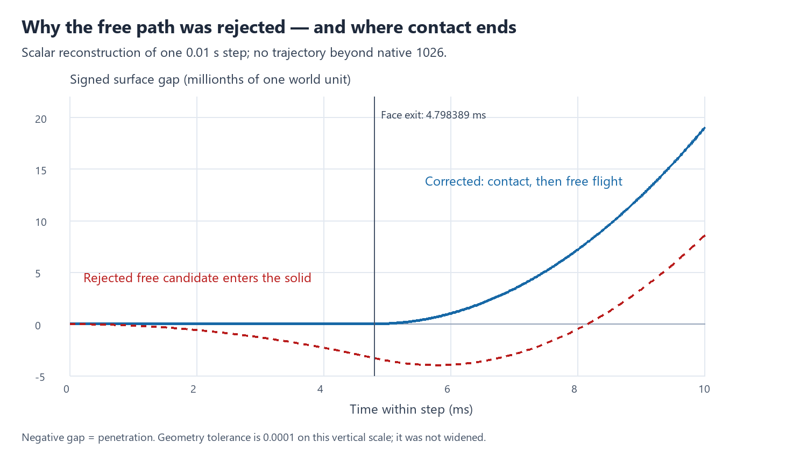

# FS-001/M2 contact apparatus diagnosis and correction

**The stop was an apparatus release-path defect in a physically legitimate flat-face-to-corner transition. The penetrating free-path guard was correct and remains active. The narrow correction and historical regression pass. A fresh nine-case packet is prepared, not authorized or executed. Overnight high-contact readiness is NOT established.**

## Exact rejected geometry

The authoritative saved boundary is MC-FS-001-M2 native 1025, time `10.249999999999826`. The rejected attempt was native 1026. Original runtime/preparation and **MOTOR_COMMISSIONING_RESULT_v0_1** remain unchanged.

| Quantity | Recovered value |
|---|---|
| Body centre / radius | (9.663002128485367, 8.999999999935511) / 0.5 |
| Heading / angular speed | 5.317310609141483 rad / 0.02164230508214243 rad/s |
| Body velocity | (-0.0930360840814401, 0) |
| Mover rectangle | x=[9.658590869197981, 11.658590869197981], y=[9.5,10.5] |
| Mover velocity / phase | (0.8263246849800095,0) / 4.301831170857631 |
| Normal / initial gap | (0,-1) / 6.448885869758669e-11 |
| Tangential distance to left edge | 0.004411259287385505 |
| Relative tangential velocity | -0.9193607690614496 |
| Delivered command | (-0.24067992715298328,-0.22884852876080816) |
| Actual new actuator forces | (-0.08932124891183013,-0.08513047983855444) |
| Geometry / overlap / event-time tolerances | 1e-10 / 1e-8 / 1e-10 |

The original `release_probe` finds zero initial separating speed and no early outward-acceleration certificate. Its whole-interval search finds a clear point at +0.01 s (gap +8.585094012691918e-6). The prefix check finds penetration at +0.005 s (gap -3.5439993126273883e-6), and raises `Free-path release prefix crosses solid before clearance`.

This is substantial relative to the tolerance, not float-spacing noise: the candidate's minimum gap is approximately **-3.9657803e-6** at +0.0057747236 s. It first crosses -geometry_tol at +0.0000338573408 s and returns to zero at +0.0081499908 s. The guard therefore cannot lawfully be removed or widened to accept that candidate.

The body's footpoint leaves the mover's flat lower face at **+0.004798389124236565 s**. Before that event the normal constraint must remain; afterwards the rounded body/rectangle-corner distance allows separation. A single free-flight decision over the whole 0.01 s interval conflated these two regimes.

The causal path is `core.step` → `Engine._coupled` → `physics.advance` → `release_probe` → `clear_excursion`. `EXACT_FAILURE_TRACE.json` preserves the original search locals, brackets, sampled gaps/rates, acceleration/jerk bounds and exception. `GEOMETRY_AUDIT.json` supplies independent scalar roots and position/displacement samples.

## Smallest supported correction

`clear_excursion` still rejects the inadmissible free path, now using an `ArithmeticError` subclass (`BlockedRelease`). The scheduler may handle that particular rejection by locating a flat-face feature event **only when there is one active axis-aligned rectangle face and a certified monotone tangential edge crossing**. Normal projection does not change tangent motion in that regime.

The absolute relative second-derivative bound is 0.7132556261992498. Even its maximum allowed tangential rate over the interval is -0.9122282127994571, proving the edge crossing is unique and ordered. Bisection returns +0.004798389151692391 s; error against the independent scalar root is 2.7455826674682715e-11 s, inside the unchanged 1e-10 s event tolerance.

The existing constrained law is advanced to that event, contact is reevaluated, and the ordinary release and swept-impact searches operate on the remainder. A missing certificate, simultaneous active contacts or a still-blocked shortened probe continues to fail explicitly. No new time-based fallback, overlap repair, position nudge, guard bypass or tolerance change was introduced.

Corrected native 1026 has:

- sustained face contact for **0.004798389151692391 s**;
- normal impulse **0.0006868940462345461**, force **0.143150966818162**;
- zero-duration release, then **0.005201610848307609 s** free flight;
- total expenditure **1.7347642279568958e-5**, no transfer, repair or additional damage;
- final centre **(9.662071305893539,9.000003872044829)**, outside the mover;
- one native organism call and one field advance; no extra RNG draw/cadence event caused by contact subdivision.

The body may have y>9 after the corner passes; that is outside the finite mover footprint, not tunnelling through its face. Normal impulse balance, all energy/source/integrity ledgers, intermediate gaps and final gaps are checked. This model is dissipative with an externally prescribed mover: “conservation” here means its declared impulse and reserve/transfer accounting, not an invented conservation of total mechanical energy.

## Tests and engineering reconstruction

**45 mechanics/scheduler tests + 2 identity tests + 26 unchanged motor component tests pass.** The exact geometry was RED on the original implementation and GREEN after correction. Neighbours include ±0.001 tangential offsets, a reflected encounter, an unended face, an already clear corner, an incoming impact and invalid overlap. Directly asking for the rejected free release still raises. A test denying the feature certificate proves the scheduler does not suppress the guard. An independent scalar oracle and dense checks within each corrected physical subinterval check nonpenetration; existing swept-impact, oblique release/return, terminal and ledger regressions remain green.

| Historical case | Exact reconstructed extent | Result |
|---|---|---|
| CURRENT FS-001 | 9000 native steps / 90 s | Bit-identical native records, events, waves, chunk neural/field/RNG digests and endpoint |
| M1 FS-001 | 9000 native steps / 90 s | Same exact checks pass |
| M2 FS-001 | 1025 native steps / 10.25 s | Same exact checks pass; failure-status metadata normalized on an engineering copy only |

CURRENT/M1 also round-trip their saved native-6000 checkpoint and complete the remaining historical path exactly. Corrected step 1026 is bit-identical from the reconstructed endpoint and a serialized pre-failure-state copy. No M2 step beyond 1026 was attempted. The corrected sample is labelled engineering evidence, not appended to the historical life.

Test-attempt provenance is retained: an early fixture-copy path mistake and a reflected-test construction error were repaired in test setup; the default pytest temporary directory was inaccessible, so a task-local temporary directory was used. The first historical reconstruction passed all three prefixes, then its tracing hook failed before physical advance because Python 3.13 frame locals cannot be deep-copied directly. The unused hook was removed and the engineering regression repeated, passing completely. Thus there were two engineering reconstructions of the historical prefixes, not two commissioning executions. No production law was adjusted to make a test pass.

## Runtime and provenance

- Frozen P mechanism reference: `6bc9683b54e4fa80136fe8534d7713e2a250a95f`.
- Parent lean apparatus: `87abae34e19d4e46234402a6b1ba776814956ec1`.
- Corrected checkpoint: **`1d7cd6fd450ea528562b2c825589ab4de18a5b38`**.
- Branch: `build/p-contact-release-20260930`.
- Corrected body/P-package code digest: `98bbf9053ca55ef545c6fc868e54c85342149d143319281a47f9a1fd71c28c7d`.
- Fresh packet runtime identity: **`5df0ced8bf5602c84852bc2074fca8d422cc39cc55b9bab00a4b653bbe714c49`**.

Production changes are confined to `loom_p/physics.py` and the exact-source binding argument of `loom_developmental/runner.py`. The entire old P package digest is not reused: physics belongs to that package, so its executable identity changes. Neural/P learning code, all configuration values, sensors, actuator constitutive equations, source laws, birth fixtures and motor-process implementation remain byte-identical. The default identity check still rejects the corrected tree; only an explicit exact corrected digest accepts it. No silent identity reconciliation occurs.

## Fresh nine-case packet — not launched

Screen ID: **MOTOR_COMMISSIONING_v0_2_CORRECTED_APPARATUS**. All nine begin independently from the already prepared zero-age states. Their complete engine bytes are identical to v0.1; only each snapshot's outer runtime identity changes. Per triplet, physical state, fields and original RNG state remain identical. M1/M2 process state, distribution, parameters and candidate RNG streams are unchanged. This fresh screen is neither a retry under an old authority nor a replacement for v0.1 evidence. Old authorizations do not apply.

| Order | Case | New authority SHA-256 |
|---:|---|---|
| 1 | MC-FS-001-CURRENT | `90d60942d787ef8e3ef717942acb6d30795e66bc16adf91e02a8b92fc58e2552` |
| 2 | MC-FS-001-M1 | `1fc115335e23737839e04f32673bd10bd9a7006e9a74aea9c4d08b55d0b9f523` |
| 3 | MC-FS-001-M2 | `87506a21a4f7b5f3f9d4303ff3b668ef9cab8c488b088b0c2f79763daa135d15` |
| 4 | MC-FS-002-CURRENT | `08c1675795c33f091397040a15bf44c22a60101a5a612f326fea5d3c3ce8c0b7` |
| 5 | MC-FS-002-M1 | `3cc7aa5a49126532e9fddf9f2b9d25bebb7df35b989f6d2845bceb92b5af4dbb` |
| 6 | MC-FS-002-M2 | `04ef62b8663d59cc42267e4c0c4f63697b5f8089961ed3afc36e9d3b9600e3c7` |
| 7 | MC-FS-003-CURRENT | `727f291b45d97a2cdd2542b08d4db6d7feadd37aabfb98fa146e7d748c8305ee` |
| 8 | MC-FS-003-M1 | `49531d2ae134443adbe1e1d80410e75c962f689fbee292615cf5981863ac8005` |
| 9 | MC-FS-003-M2 | `13f5534f8f3c09c0e021a17750e376be89d86796c6e1bb56f312b3df099ccf2e` |

Ceilings and recording remain **90 s / 9000 steps, 300 active wall s and 32 MB per case**, with the original 16 MB closure reserve, 100-step chunks, 6000-step checkpoints and complete Tier-1/motor evidence. Batch allowance stays 2700 active wall s; preflight/verification allowances stay 300/600 s. Require 2 GB free before batch and 1 GB before each case. Shared apparatus/resource failure stops the batch with later cases unstarted. No retry, continuation, tuning or selection permission is included.

Historical planning range remains **4.3–14.2 active minutes and about 59–77 MB primary evidence** for nine cases, before compact motor diagnostics and archive overhead. The two completed motor cases took about 67 s combined; corrected historical reconstruction took 70.8 s for the available 19025-step denominator plus the two single-step checks. These support the existing envelope, not a guarantee for new contacts. The resource limits and evidence fidelity were not reduced. Full source/runtime/start preflight passed on the fresh packet, and must run again immediately before any separately authorized launch.

## Overnight readiness and stop

**NOT READY TO DECLARE AN OVERNIGHT HIGH-CONTACT SANDBOX SAFE.** The exact defect is resolved and the new bounded screen is fit to propose. These checks do not cover many hours, all curved/simultaneous contact regimes or every resource/interruption path. The original solver's explicit guards remain for uncertified cases, and the separate FS-060 interruption has not been diagnosed here. Broader readiness must be established separately; a successful 90 s screen alone would not prove it.

No fresh motor-screen case, long run, Nursery change, resurrection, motor tuning, new prehistory, push or merge occurred. v0.1 remains immutable historical evidence. Stop for Jason review.
