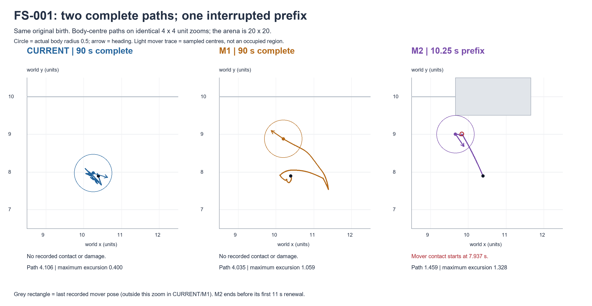
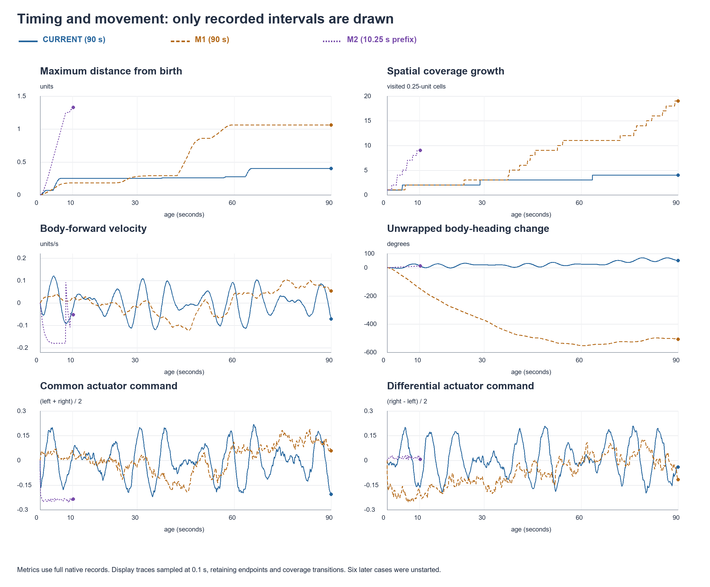

# M1/M2 motor commissioning — bounded result and apparatus stop

**The nine-case matrix is incomplete because the prepared shared-apparatus stop rule fired. Two cases completed; one has a verified 10.25 s prefix; six were never started. No retry, continuation, replacement or patch occurred. No motor mechanism is selected. CURRENT remains the reference.**

FS-001/M2 stopped while attempting native step 1026. The original physical contact-path guard raised `ArithmeticError: Free-path release prefix crosses solid before clearance`. Its last committed native index is **1025**, nominal age **10.25 s**. The executing process exited with failure; nothing remains running for this batch. This is an apparatus stop, not biological nonviability and not evidence that M2 is physically impossible.

## Exact denominator

| Order | Authorized case | Disposition | Committed native steps | Nominal recorded age (s) |
|---:|---|---|---:|---:|
| 1 | MC-FS-001-CURRENT | 90 s completed | 9000 | 90.00 |
| 2 | MC-FS-001-M1 | 90 s completed | 9000 | 90.00 |
| 3 | MC-FS-001-M2 | Apparatus-interrupted prefix | 1025 | 10.25 |
| 4 | MC-FS-002-CURRENT | Unstarted after batch stop | — | — |
| 5 | MC-FS-002-M1 | Unstarted after batch stop | — | — |
| 6 | MC-FS-002-M2 | Unstarted after batch stop | — | — |
| 7 | MC-FS-003-CURRENT | Unstarted after batch stop | — | — |
| 8 | MC-FS-003-M1 | Unstarted after batch stop | — | — |
| 9 | MC-FS-003-M2 | Unstarted after batch stop | — | — |

Unstarted means **unobserved**, not zero movement/contact/cost. The original executor `DENOMINATOR.json` retains its failed-case `STARTED` / zero-counter entry because that row is normally finalized after closure. It was not edited. `DENOMINATOR_RECONCILIATION.json` derives M2's actual boundary from `failure-s000.json`, the saved chunks and `failure-tail-s000.ld`.

The two completed cases each contain exactly **9000 native steps**, nominal 90 s. Their accumulated floating clock is `90.00000000000914`; this is the original binary64 sum of 9000 × 0.01, not an additional step or a changed ceiling. M2's stored clock is `10.249999999999826`.

## What the available comparison shows

- **CURRENT:** repeated local forward/reverse travel. At 90 s, path length is 4.106 units but maximum birth excursion is only 0.400 and final displacement 0.159. There were 20 qualifying forward/reverse switches. This run reproduces the preserved original FS-001's first 9000 native rows exactly, across all recorded native fields.
- **M1:** in this one matched start, path length is similar (4.035 units), while maximum excursion is 1.059 and final displacement 1.003. Effort cost is 0.18% lower than CURRENT, and neither recorded contact or damage. The larger reach therefore did not coincide with greater total effort or impacts in this particular 90 s comparison. However, M1 made **31% more absolute body-heading rotation**, spent more time predominantly rotating, and its first 10 s had less maximum excursion and more effort than CURRENT. This is a different temporal/curving regime, not a selected improvement or evidence of general superiority.
- **M2:** the 10.25 s prefix is dominated by a coherent negative common drive and movement mainly backwards relative to the body. It contacted the mover and sustained integrity damage. Over the common first 10 s, effort was **68.9% higher than CURRENT** (16.1% higher than M1). Its larger early reach is therefore confounded with a stronger realized command sample and contact dynamics; it must not be called an unqualified exploration improvement. The fixed first renewal was at **11 s**, so **no M2 target renewal occurred before the apparatus stop**. The irregular-renewal regime remains unobserved in this world screen.

The parameters were not changed and no observation was used to choose a new phase, draw, start or route. M2's birth common latent was -1.347284973074013 with differential 0.14468104530650436, exactly the prepared draw. Its two spontaneous terms stayed at approximately -0.31629005 and -0.29205650 before the first renewal. Equal population-scale RMS proposals do not force equal strength in a short realization. No cause share between timing, realized strength and collision effects is identified by this interrupted sample.

## Native path and coverage

All distances are world units. Path is the native body-centre polyline, including the segment from the preserved birth position. Coverage counts visited body-centre bins, not swept physical area. Re-entry counts a transition into an already visited bin after leaving it.

| Process | Observed seconds | Path | Maximum excursion | Final displacement | Displacement/path | 0.25-unit bins | Re-entry transitions |
|---|---:|---:|---:|---:|---:|---:|---:|
| CURRENT | 90.00 | 4.106441 | 0.400002 | 0.158675 | 0.038640 | 4 | 15/18 |
| M1 | 90.00 | 4.034823 | 1.058527 | 1.003345 | 0.248671 | 19 | 3/21 |
| M2 | 10.25 | 1.458674 | 1.327939 | 1.327939 | 0.910374 | 9 | 1/9 |

CURRENT's 0.25-bin re-entry fraction is 83.33%; M1's is 14.29%; M2's prefix is 11.11%. At the predeclared half-bin offset the fractions are 80.95%, 21.74% and 0%, respectively. At 1-unit resolution they are 50%, 40% and 25%, with only 2, 5 and 4 transitions. These small grid counts depend on alignment and are not precise arena-coverage percentages.



| Process | Age (s) | Maximum excursion | 0.25 bins | 1-unit bins | Offset 0.25 bins |
|---|---:|---:|---:|---:|---:|
| CURRENT | 0.00 | 0.000000 | 1 | 1 | 1 |
| CURRENT | 10.00 | 0.249533 | 2 | 1 | 4 |
| CURRENT | 30.00 | 0.249533 | 3 | 1 | 4 |
| CURRENT | 60.00 | 0.275188 | 3 | 1 | 4 |
| CURRENT | 90.00 | 0.400002 | 4 | 2 | 5 |
| M1 | 0.00 | 0.000000 | 1 | 1 | 1 |
| M1 | 10.00 | 0.180538 | 2 | 1 | 3 |
| M1 | 30.00 | 0.277238 | 3 | 1 | 5 |
| M1 | 60.00 | 1.058527 | 11 | 3 | 11 |
| M1 | 90.00 | 1.058527 | 19 | 4 | 19 |
| M2 | 0.00 | 0.000000 | 1 | 1 | 1 |
| M2 | 10.00 | 1.315427 | 9 | 4 | 8 |
| M2 | 10.25 | 1.327939 | 9 | 4 | 8 |

## Matched first 10 seconds

Ten seconds was already a declared reporting age and is available in all three started cases. This table prevents treating M2's short prefix as a full-length comparison.

| Process | Path | Maximum excursion | Displacement/path | Effort cost | Total impulse | Damage |
|---|---:|---:|---:|---:|---:|---:|
| CURRENT | 0.631135 | 0.249533 | 0.200380 | 0.00141616 | 0.000000 | 0.00000000 |
| M1 | 0.211049 | 0.180538 | 0.853833 | 0.00205989 | 0.000000 | 0.00000000 |
| M2 | 1.435670 | 1.315427 | 0.916246 | 0.00239199 | 0.479381 | 0.00781686 |

M1's early effort cost is 45.46% above CURRENT while its maximum excursion is smaller (0.181 versus 0.250). Its larger later reach at similar total cost does not erase this early tradeoff. No interval was used as a selection gate.

## Reversals, heading and command organization

Forward/reverse bouts use native body-frame forward velocity above +0.01 or below -0.01 units/s. This table includes bouts lasting at least 0.1 s. Switches compare successive qualifying signs, ignoring deadband; they are body-velocity changes, not commanded semantic actions. Final bouts are right-censored by the recording boundary and remain included as observed durations. Complete bout lists and predeclared 0.005/0.02 sensitivity summaries are retained in each `*_DETAILS.json`.

| Process | Forward bouts | Median s | Maximum s | Reverse bouts | Median s | Maximum s | Switches |
|---|---:|---:|---:|---:|---:|---:|---:|
| CURRENT | 12 | 3.480 | 6.590 | 13 | 3.490 | 4.090 | 20 |
| M1 | 4 | 6.405 | 30.760 | 4 | 6.775 | 15.730 | 4 |
| M2 | 1 | 0.420 | 0.420 | 2 | 4.800 | 7.810 | 2 |

| Process | Mean speed | Mean absolute angular speed (rad/s) | Net heading change | Total absolute rotation | Predominantly rotating | Predominantly translating |
|---|---:|---:|---:|---:|---:|---:|
| CURRENT | 0.04563 | 0.09232 | 50.23° | 476.08° | 36.89% | 35.41% |
| M1 | 0.04483 | 0.12088 | -507.45° | 623.34° | 42.22% | 33.96% |
| M2 | 0.14235 | 0.01940 | 11.39° | 11.39° | 0.00% | 99.32% |

Headings are unwrapped: M1's -507° net change is not reduced modulo one turn. “Predominantly” uses the prepared ratio of body-edge rotational speed to translational speed (>2 in either direction), with activity threshold 0.005. These are kinematic classifications, not intent or actuator energy partitions.

| Process | Common command RMS | Differential command RMS | Left/right correlation | Opposed command signs |
|---|---:|---:|---:|---:|
| CURRENT | 0.103418 | 0.104317 | -0.006256 | 52.10% |
| M1 | 0.085072 | 0.120112 | -0.090707 | 55.44% |
| M2 | 0.239750 | 0.016944 | 0.755891 | 0.00% |

M2's recorded commands stay negative on both sides; its brief body-forward movement does not establish a spontaneous motor reversal. It occurred in the prefix containing mover interactions. M1's sustained differential tendency produces much more heading drift than CURRENT, even while its velocity direction persists longer at several lags.



Velocity-direction correlation uses unit velocity vectors only where both speeds exceed 0.01, sampled at exact 0.1 s indices. Heading correlation is the mean cosine of heading differences. These are lag descriptions, not fitted persistence or diffusion constants; M2 has no 16 s observation.

| Process | Lag (s) | Velocity-direction correlation | Valid pairs | Heading correlation |
|---|---:|---:|---:|---:|
| CURRENT | 0.1 | 0.9997 | 749 | 0.9999 |
| CURRENT | 0.5 | 0.9104 | 682 | 0.9984 |
| CURRENT | 1 | 0.6429 | 664 | 0.9938 |
| CURRENT | 2 | 0.0925 | 665 | 0.9790 |
| CURRENT | 4 | -0.7896 | 651 | 0.9569 |
| CURRENT | 8 | 0.4949 | 608 | 0.9807 |
| CURRENT | 16 | -0.0938 | 559 | 0.9513 |
| M1 | 0.1 | 0.9999 | 744 | 0.9999 |
| M1 | 0.5 | 0.9982 | 713 | 0.9972 |
| M1 | 1 | 0.9789 | 683 | 0.9887 |
| M1 | 2 | 0.9001 | 642 | 0.9554 |
| M1 | 4 | 0.7124 | 601 | 0.8342 |
| M1 | 8 | 0.3838 | 569 | 0.4840 |
| M1 | 16 | 0.0830 | 501 | 0.0218 |
| M2 | 0.1 | 0.9787 | 100 | 1.0000 |
| M2 | 0.5 | 0.8791 | 96 | 0.9999 |
| M2 | 1 | 0.8366 | 91 | 0.9998 |
| M2 | 2 | 0.8206 | 81 | 0.9992 |
| M2 | 4 | 0.7543 | 61 | 0.9967 |
| M2 | 8 | 0.4024 | 21 | 0.9870 |
| M2 | 16 | — | 0 | — |

## Expenditure, contact and damage

All three cases started at E=0.7, I=1. Expenditure is retained separately from intake; basal and effort terms are checked against the existing event ledger. The totals below use each case's available duration, so M2's lower total expenditure must not be interpreted as lower cost for a 90 s case.

| Process | Total expenditure | Basal | Effort | Final E | Final I | Total impulse | Damage |
|---|---:|---:|---:|---:|---:|---:|---:|
| CURRENT | 0.14681584 | 0.13500000 | 0.01181584 | 0.55318416 | 1.00000000 | 0.000000 | 0.00000000 |
| M1 | 0.14679509 | 0.13500000 | 0.01179509 | 0.55320491 | 1.00000000 | 0.000000 | 0.00000000 |
| M2 | 0.01782681 | 0.01537500 | 0.00245181 | 0.68217319 | 0.99218314 | 0.515846 | 0.00781686 |

CURRENT and M1 had **no recorded wall, mover, source, restorative or other contact** in their 90 s records. M2 had mover contact only: first at **7.9372436806 s**, continuing intermittently through the final committed sample. Recorded positive-duration contact totals **0.8543180794 s**; this is not the whole time between first and last touch. Its 88 contact records are subinterval/impact records, not 88 independent collisions.

M2's impulse totals are **0.3908428989 instantaneous** and **0.1250031008 sustained**, total **0.5158459997**. Largest instantaneous impulse is **0.3088411675**. Peak sustained force is **0.1519709625**, below the 0.25 stress threshold; the **0.0078168580** recorded damage is accounted for by instantaneous impacts. M2's final E and I remain positive. Wall/other contact, repair, source contact and source transfer are zero in the **available** records. Six unstarted cases have no observations for these quantities.

Source absence is descriptive only. It is not a motor selection criterion, viability score or inference about future food access.

## Ordinary feedback/regulatory susceptibility

At every recorded wave the observer used the saved spontaneous, direct-feedback, associative and current contributions. It calculated

$$g=(1-\alpha)\,\operatorname{sech}^2(o+\mathrm{direct}+\mathrm{evoked}+i).$$

This is the local command-target gain before the unchanged motor relaxation; the immediate 0.01 s response additionally contains $1-e^{-0.01/0.1}$. It is not an experimental intervention or a learned-competence measure.

| Process | Saved waves | Minimum g | Median g | Attenuation range | Direct-feedback RMS | Regulatory-current RMS | Associative-return RMS |
|---|---:|---:|---:|---|---:|---:|---:|
| CURRENT | 450 | 0.698772 | 0.776207 | 0.1871–0.2138 | 0.004915 | 0.014836 | 7.17e-08 |
| M1 | 450 | 0.697930 | 0.776468 | 0.1871–0.2138 | 0.003753 | 0.014850 | 3.49e-07 |
| M2 | 51 | 0.698808 | 0.728723 | 0.1884–0.2122 | 0.010584 | 0.014415 | 1.2e-07 |

No saved sample has tanh gain below 0.1 or attenuation above 0.95. There is **no recorded evidence of saturation or attenuation practically closing the ordinary additive pathway** in the observed intervals. However, actual current is only about 0.014–0.015 RMS, direct feedback is smaller, and the associative return is very small relative to spontaneous drive. In M2's strong negative initial tendency those realized inputs did not reverse the commands. Available sensitivity is not proof that the existing learning can develop adequate control. Physical contact can also restrict achieved movement despite responsive commands. Unobserved M2 time and the unstarted six cases supply no coupling evidence.

## Apparatus boundary and custody

The stored traceback follows `Life.advance` → unchanged `loom_developmental/core.py:47` → `Engine._coupled` → `physics.advance:285` → `release_probe:207` → `clear_excursion:160`. The exact rejection is:

```python
if search(probe, -1., c.geometry_tol) is not None:
    raise ArithmeticError('Free-path release prefix crosses solid before clearance')
```

The guard rejects a proposed release path that has a detected inward solid crossing before a later clear point. This explanation comes from the unchanged source and recorded exception, not a new physical rollout. The saved prefix ends during mover contact. The exception does not store the internal probe scalar values, so this report does not invent them or claim a complete root-cause diagnosis. No failed step was rerun and no guard was widened or bypassed.

M2 has ten closed chunks through step 1000 plus **25 additional committed native rows**, one wave and their events in `failure-tail-s000.ld`. The complete available denominator contains **19025 native rows**: 9000 + 9000 + 1025. Row clocks, sequence, wave indices, native/event counts, endpoint body/reserves and physical ledgers validate. M2 has no normal final segment receipt; a verified prefix is not relabelled as a completed case. All available bytes were sealed before metrics in `EXECUTION_CUSTODY_SEAL.json`.

All prepared hashes and full-runtime preflight passed before launch. The unchanged executor repeated its full gate immediately before each of the three started cases. Its completed-case active-wall counter is **67.001994 s**; it omits the failed case because that case has no normal stop receipt. Preflight total is **3.510746 s**, completed-store verification **3.208827 s**. Do not read the completed-case counter as exact total batch wall time. Available execution files occupy **16,524,083 bytes**. The cause was the contact-path exception, not a reported wall/storage cutoff. The prepared resource limits were not enlarged.

## Identity, limitations and disposition

The nine authority hashes are the exact objects in the unchanged preparation `AUTHORITY_INDEX.md` and the copied `execution/JASON_AUTHORIZATION.json`. Frozen P baseline is `6bc9683b54e4fa80136fe8534d7713e2a250a95f`; lean base is `87abae34e19d4e46234402a6b1ba776814956ec1`; bound overlay/runtime identity is `d1b14d75dc30e2934c76e209e0354ca236ac0115f381b4cbbf5c15093ba9a41a`. M1/M2 retain their separately identified spontaneous replacement; neither is described as identical to intact CURRENT.

Only the prepared passive comparison was performed after the stop. No neural/world replay, extra trial, outcome-based reordering, tuning, founder scoring or automatic selection was performed. Canonical P/world/sensor/source/learning laws, the original birth law, Nursery-0 geometry and viability/resilience were not changed. Normal within-life learning proceeded only inside the authorized executed cases. CURRENT is preserved as the reference.

The requested full three-start comparison remains **unavailable**. Missing evidence includes M2 after its first renewal, M2's 90 s cost/coverage/coupling, all FS-002/003 results, and cross-start consistency. These records cannot establish a preferred mechanism, developmental benefit, food competence or long-run safety. A diagnosis/correction or any future execution requires a separate Jason decision; no replacement packet or continuation is prepared here.

**Stop for Jason review.**
