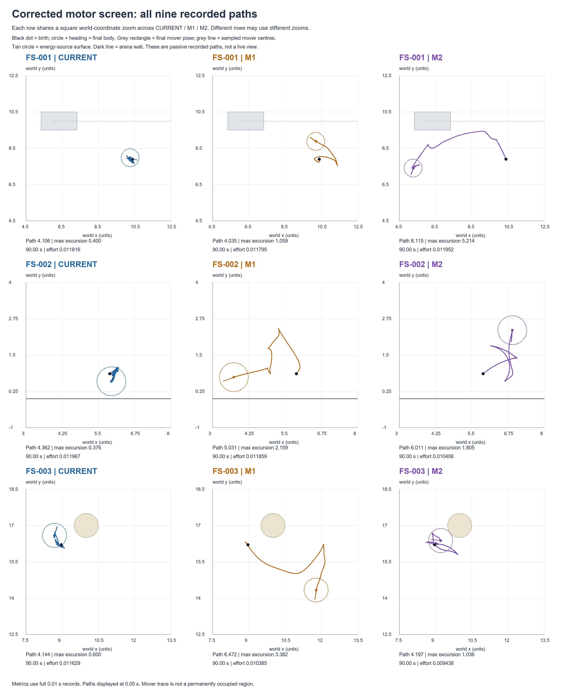
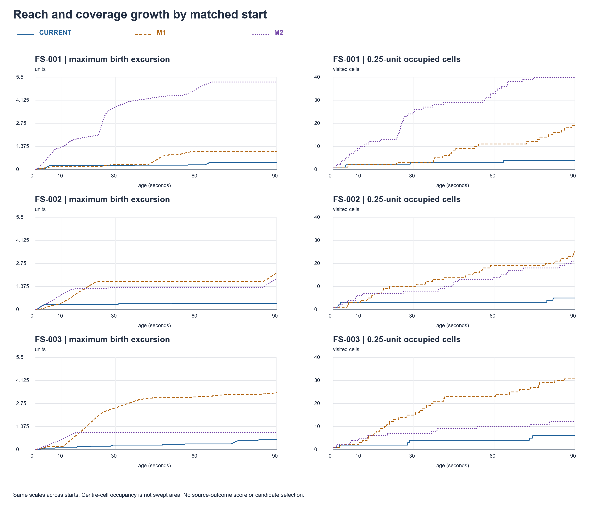
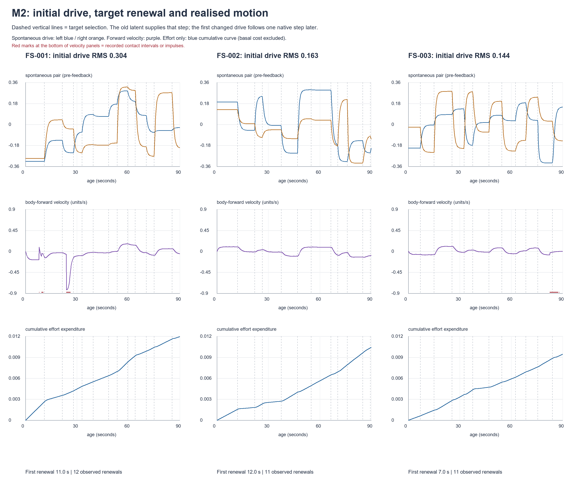

# MOTOR_COMMISSIONING_RESULT_v0_2

All nine fresh, independently initialized cases completed once, in the authorized order, at 90 seconds / 9000 native steps. No apparatus failure, biological terminal stop, administrative cutoff, retry or continuation occurred. The complete denominator is retained. Execution is finished.

The FS-001 M1 observation replicated exactly: similar path length and effort to CURRENT, substantially greater reach and lower recurrence. Across these three fixed starts, M1 showed longer velocity-direction persistence and fewer forward/reverse switches, without greater aggregate effort or any contact. M2 showed variable realized drive and exposure across starts; its large FS-001 reach includes strong mover interaction and damage. These are bounded descriptions of these draws and starts, not a motor-selection rule or developmental-efficacy result. CURRENT remains the reference. No candidate is selected.

This is a new common-apparatus screen. `MOTOR_COMMISSIONING_RESULT_v0_1` remains unchanged historical interrupted evidence. It is neither overwritten nor treated as a continuation of this result.

## Identity and authority

Corrected apparatus checkpoint: `1d7cd6fd450ea528562b2c825589ab4de18a5b38`.

Runtime identity: `5df0ced8bf5602c84852bc2074fca8d422cc39cc55b9bab00a4b653bbe714c49`.

Local branch: `build/p-contact-release-20260930`.

Worktree: `C:\Users\Jason\.codex\.chatgpt-projects\g-p-6a6fb425222c8191a814fdc0f7d89f97\worktrees\loom-contact-release-20260930`.

Historical P baseline: `6bc9683b54e4fa80136fe8534d7713e2a250a95f`. The corrected body/P package digest is `98bbf9053ca55ef545c6fc868e54c85342149d143319281a47f9a1fd71c28c7d`, distinct from the old `63a0241e57756aa5d0fb69c661b59dd9ddb08d53947ffc16005e483caec65ad9`. This reflects the already-reviewed contact-event correction, not a change to P neural learning. The common corrected apparatus was used for all nine cases. No production code changed in this execution task.

Configuration identity: `a97335ec22445cacf66831290444f933986774f6a63c9f11626988e6781a7d3a`. The prepared motor parameter object, stochastic laws, matched FS-001/002/003 states, ordinary birth law, source laws, viability and geometry remained fixed. No new field prehistory was generated.

The frozen preparation still says `PROPOSED_UNAUTHORIZED`: its bytes were deliberately preserved. Jason's subsequent authorization is separately recorded in `execution/JASON_AUTHORIZATION.json` and the single-use start record. This report creates no new authority.

| Order | Case | Authorized SHA-256 | Disposition |
| --- | --- | --- | --- |
| 1 | MC-FS-001-CURRENT | `90d60942d787ef8e3ef717942acb6d30795e66bc16adf91e02a8b92fc58e2552` | 9000 / 90 s complete |
| 2 | MC-FS-001-M1 | `1fc115335e23737839e04f32673bd10bd9a7006e9a74aea9c4d08b55d0b9f523` | 9000 / 90 s complete |
| 3 | MC-FS-001-M2 | `87506a21a4f7b5f3f9d4303ff3b668ef9cab8c488b088b0c2f79763daa135d15` | 9000 / 90 s complete |
| 4 | MC-FS-002-CURRENT | `08c1675795c33f091397040a15bf44c22a60101a5a612f326fea5d3c3ce8c0b7` | 9000 / 90 s complete |
| 5 | MC-FS-002-M1 | `3cc7aa5a49126532e9fddf9f2b9d25bebb7df35b989f6d2845bceb92b5af4dbb` | 9000 / 90 s complete |
| 6 | MC-FS-002-M2 | `04ef62b8663d59cc42267e4c0c4f63697b5f8089961ed3afc36e9d3b9600e3c7` | 9000 / 90 s complete |
| 7 | MC-FS-003-CURRENT | `727f291b45d97a2cdd2542b08d4db6d7feadd37aabfb98fa146e7d748c8305ee` | 9000 / 90 s complete |
| 8 | MC-FS-003-M1 | `49531d2ae134443adbe1e1d80410e75c962f689fbee292615cf5981863ac8005` | 9000 / 90 s complete |
| 9 | MC-FS-003-M2 | `13f5534f8f3c09c0e021a17750e376be89d86796c6e1bb56f312b3df099ccf2e` | 9000 / 90 s complete |

## Execution, evidence and resources

The full runtime/source/authority/state preflight passed before the batch and was repeated immediately before each case by the unchanged executor. `execution/PREFLIGHT.json` records the batch gate; per-case start/stop/verification records and the executor source establish the subsequent gates. The gate checked the exact runtime, authority order, all prepared snapshots, original fixtures and prehistory, matched initial state except the declared spontaneous process, fixed bounds and absence of retry/continuation permission. There was no outcome-dependent decision between cases.

All 81,000 native rows, 4,050 wave records and 82,699 event/ledger rows were preserved and passively checked. Every case has its initial, 6000-step periodic and 9000-step final checkpoint, 90 native chunks, a closed receipt and a read-only verification result. The complete 896-file execution tree was hashed before analysis. Native time, endpoint body/reserves, wave indices, event counts, expenditure, transfer/stock and damage/repair ledgers reconcile. Largest per-event accounting residual: 5.551e-17; allowed arithmetic tolerance is 1e-12.

The nominal ceiling is index-derived 90 seconds. The recorded accumulated float clock is 90.00000000000914 seconds for each case (about 9.14e-12 s roundoff); no additional native step occurred.

Active execution took 319.493 s against 2700 s; preflight 24.159 s against 300 s; store verification 13.856 s against 600 s. Execution evidence occupies 67,792,479 bytes (67.79 decimal MB), including shared assets and batch metadata. All individual cases were below the unchanged 300 s and 32 MB bounds. The 16 MB closure reserve was retained; no fidelity or cadence was reduced. Passive decoding/metrics took 10.838 s. Archive/reporting had a separate 300 s planning reserve, not a simulated-time allowance or a permission for more cases.

The host emitted a read warning about its global Git ignore file. All required source/status/runtime checks succeeded; no workaround, patch or Git write was made.

| Case | Active wall s | Case evidence bytes |
| --- | --- | --- |
| FS-001-CURRENT | 34.823 | 7257157 |
| FS-001-M1 | 47.550 | 7222406 |
| FS-001-M2 | 37.760 | 9064350 |
| FS-002-CURRENT | 30.956 | 7080800 |
| FS-002-M1 | 32.959 | 7183538 |
| FS-002-M2 | 32.779 | 7254820 |
| FS-003-CURRENT | 34.998 | 7261628 |
| FS-003-M1 | 31.940 | 7086815 |
| FS-003-M2 | 35.727 | 7944541 |

## Movement and spatial exposure

Distances are world units. Path is the complete native body-centre polyline, including externally induced motion. Excursion is the maximum distance from the original birth position; final displacement is reported separately. Coverage counts body-centre bins, not traversable area or swept body volume. Revisit fraction counts transitions into an already visited bin after leaving it; it is not a fraction of time spent stationary. No outcome-based threshold or normalization was applied.

| Case | Path | Max excursion | Final displacement | Displacement/path | 0.25 cells | Revisit fraction |
| --- | --- | --- | --- | --- | --- | --- |
| FS-001-CURRENT | 4.106 | 0.400 | 0.159 | 0.039 | 4 | 0.833 |
| FS-001-M1 | 4.035 | 1.059 | 1.003 | 0.249 | 19 | 0.143 |
| FS-001-M2 | 8.115 | 5.214 | 5.146 | 0.634 | 40 | 0.152 |
| FS-002-CURRENT | 4.362 | 0.376 | 0.272 | 0.062 | 5 | 0.826 |
| FS-002-M1 | 5.031 | 2.159 | 2.159 | 0.429 | 25 | 0.143 |
| FS-002-M2 | 6.011 | 1.805 | 1.805 | 0.300 | 21 | 0.333 |
| FS-003-CURRENT | 4.144 | 0.600 | 0.480 | 0.116 | 6 | 0.800 |
| FS-003-M1 | 6.472 | 3.382 | 3.382 | 0.523 | 31 | 0.032 |
| FS-003-M2 | 4.197 | 1.036 | 0.300 | 0.071 | 12 | 0.450 |

Grid sensitivity is retained rather than selecting the most favorable placement. The half-cell offset adds 0.125 to both coordinates before binning. The one-unit grid can have very few transitions, so its revisit fractions are coarse.

| Case | 0.25 cells / returns / transitions | Half-offset cells / revisit | 1-unit cells / revisit |
| --- | --- | --- | --- |
| FS-001-CURRENT | 4 / 15 / 18 | 5 / 0.810 | 2 / 0.500 |
| FS-001-M1 | 19 / 3 / 21 | 19 / 0.217 | 4 / 0.400 |
| FS-001-M2 | 40 / 7 / 46 | 39 / 0.073 | 10 / 0.182 |
| FS-002-CURRENT | 5 / 19 / 23 | 4 / 0.889 | 3 / 0.900 |
| FS-002-M1 | 25 / 4 / 28 | 24 / 0.080 | 7 / 0.500 |
| FS-002-M2 | 21 / 10 / 30 | 21 / 0.286 | 5 / 0.429 |
| FS-003-CURRENT | 6 / 20 / 25 | 5 / 0.750 | 2 / 0.750 |
| FS-003-M1 | 31 / 1 / 31 | 33 / 0.086 | 9 / 0.111 |
| FS-003-M2 | 12 / 9 / 20 | 15 / 0.364 | 3 / 0.714 |

Coverage and excursion growth at the fixed ages follow. The complete companion CSV also contains path, final displacement and offset/one-unit coverage at these ages.

| Case | Age s | Path | Max excursion | Displacement | 0.25 / 1-unit cells |
| --- | --- | --- | --- | --- | --- |
| FS-001-CURRENT | 0 | 0.000 | 0.000 | 0.000 | 1 / 1 |
| FS-001-CURRENT | 10 | 0.631 | 0.250 | 0.126 | 2 / 1 |
| FS-001-CURRENT | 30 | 1.379 | 0.250 | 0.184 | 3 / 1 |
| FS-001-CURRENT | 60 | 2.832 | 0.275 | 0.147 | 3 / 1 |
| FS-001-CURRENT | 90 | 4.106 | 0.400 | 0.159 | 4 / 2 |
| FS-001-M1 | 0 | 0.000 | 0.000 | 0.000 | 1 / 1 |
| FS-001-M1 | 10 | 0.211 | 0.181 | 0.180 | 2 / 1 |
| FS-001-M1 | 30 | 0.550 | 0.277 | 0.277 | 3 / 1 |
| FS-001-M1 | 60 | 2.177 | 1.059 | 1.049 | 11 / 3 |
| FS-001-M1 | 90 | 4.035 | 1.059 | 1.003 | 19 / 4 |
| FS-001-M2 | 0 | 0.000 | 0.000 | 0.000 | 1 / 1 |
| FS-001-M2 | 10 | 1.436 | 1.315 | 1.315 | 9 / 4 |
| FS-001-M2 | 30 | 4.633 | 3.714 | 3.714 | 24 / 8 |
| FS-001-M2 | 60 | 6.297 | 4.768 | 4.768 | 33 / 9 |
| FS-001-M2 | 90 | 8.115 | 5.214 | 5.146 | 40 / 10 |
| FS-002-CURRENT | 0 | 0.000 | 0.000 | 0.000 | 1 / 1 |
| FS-002-CURRENT | 10 | 0.634 | 0.309 | 0.129 | 3 / 3 |
| FS-002-CURRENT | 30 | 1.509 | 0.309 | 0.217 | 3 / 3 |
| FS-002-CURRENT | 60 | 2.975 | 0.376 | 0.320 | 3 / 3 |
| FS-002-CURRENT | 90 | 4.362 | 0.376 | 0.272 | 5 / 3 |
| FS-002-M1 | 0 | 0.000 | 0.000 | 0.000 | 1 / 1 |
| FS-002-M1 | 10 | 0.411 | 0.385 | 0.385 | 3 / 3 |
| FS-002-M1 | 30 | 2.052 | 1.680 | 1.455 | 10 / 4 |
| FS-002-M1 | 60 | 3.482 | 1.680 | 0.921 | 19 / 6 |
| FS-002-M1 | 90 | 5.031 | 2.159 | 2.159 | 25 / 7 |
| FS-002-M2 | 0 | 0.000 | 0.000 | 0.000 | 1 / 1 |
| FS-002-M2 | 10 | 0.876 | 0.871 | 0.871 | 6 / 3 |
| FS-002-M2 | 30 | 1.458 | 1.298 | 1.296 | 8 / 4 |
| FS-002-M2 | 60 | 3.420 | 1.298 | 0.969 | 14 / 4 |
| FS-002-M2 | 90 | 6.011 | 1.805 | 1.805 | 21 / 5 |
| FS-003-CURRENT | 0 | 0.000 | 0.000 | 0.000 | 1 / 1 |
| FS-003-CURRENT | 10 | 0.125 | 0.097 | 0.086 | 2 / 2 |
| FS-003-CURRENT | 30 | 1.432 | 0.268 | 0.262 | 4 / 2 |
| FS-003-CURRENT | 60 | 2.780 | 0.343 | 0.123 | 4 / 2 |
| FS-003-CURRENT | 90 | 4.144 | 0.600 | 0.480 | 6 / 2 |
| FS-003-M1 | 0 | 0.000 | 0.000 | 0.000 | 1 / 1 |
| FS-003-M1 | 10 | 0.437 | 0.167 | 0.108 | 3 / 2 |
| FS-003-M1 | 30 | 2.982 | 2.481 | 2.481 | 15 / 5 |
| FS-003-M1 | 60 | 4.692 | 3.136 | 3.136 | 23 / 7 |
| FS-003-M1 | 90 | 6.472 | 3.382 | 3.382 | 31 / 9 |
| FS-003-M2 | 0 | 0.000 | 0.000 | 0.000 | 1 / 1 |
| FS-003-M2 | 10 | 0.627 | 0.611 | 0.611 | 5 / 3 |
| FS-003-M2 | 30 | 2.100 | 1.036 | 0.073 | 7 / 3 |
| FS-003-M2 | 60 | 3.000 | 1.036 | 0.264 | 10 / 3 |
| FS-003-M2 | 90 | 4.197 | 1.036 | 0.300 | 12 / 3 |

## Bouts, direction persistence and body heading

Forward/reverse means signed velocity in the actual body frame, with thresholds +0.01 / −0.01 units/s. Qualifying bouts last at least 0.1 s. Counts and medians below include a final right-censored bout where present. Switches count changes of sign between qualifying bouts, including low-speed gaps. The full JSON retains every bout and the prescribed 0.005 / 0.02 threshold sensitivity. A heading can remain similar while velocity reverses; heading and travel-direction correlations are therefore separate.

| Case | Forward count / median s | Reverse count / median s | Switches | Mean speed | Mean abs angular speed rad/s | Abs / net heading degrees |
| --- | --- | --- | --- | --- | --- | --- |
| FS-001-CURRENT | 12 / 3.480 | 13 / 3.490 | 20 | 0.0456 | 0.0923 | 476.1 / 50.2 |
| FS-001-M1 | 4 / 6.405 | 4 / 6.775 | 4 | 0.0448 | 0.1209 | 623.3 / -507.5 |
| FS-001-M2 | 3 / 9.770 | 4 / 8.470 | 6 | 0.0902 | 0.0817 | 421.2 / -43.4 |
| FS-002-CURRENT | 11 / 3.640 | 11 / 3.730 | 21 | 0.0485 | 0.0933 | 481.1 / 28.6 |
| FS-002-M1 | 4 / 14.840 | 5 / 1.640 | 4 | 0.0559 | 0.1035 | 533.9 / -198.3 |
| FS-002-M2 | 3 / 15.100 | 5 / 2.520 | 5 | 0.0668 | 0.0730 | 376.6 / -135.7 |
| FS-003-CURRENT | 11 / 3.760 | 9 / 3.420 | 17 | 0.0460 | 0.0877 | 452.3 / -60.9 |
| FS-003-M1 | 3 / 5.010 | 4 / 2.755 | 4 | 0.0719 | 0.0588 | 303.2 / 126.0 |
| FS-003-M2 | 4 / 8.995 | 6 / 6.490 | 8 | 0.0466 | 0.0980 | 505.4 / 39.3 |

| Case | Direction correlation 2 / 4 / 8 s | Valid pairs 2 / 4 / 8 s | Heading correlation 2 / 4 / 8 s | Rotating / translating / inactive fraction |
| --- | --- | --- | --- | --- |
| FS-001-CURRENT | 0.092 / -0.790 / 0.495 | 665 / 651 / 608 | 0.979 / 0.957 / 0.981 | 0.369 / 0.354 / 0.002 |
| FS-001-M1 | 0.900 / 0.712 / 0.384 | 642 / 601 / 569 | 0.955 / 0.834 / 0.484 | 0.422 / 0.340 / 0.001 |
| FS-001-M2 | 0.854 / 0.660 / 0.297 | 791 / 761 / 721 | 0.983 / 0.934 / 0.777 | 0.188 / 0.402 / 0.001 |
| FS-002-CURRENT | 0.101 / -0.764 / 0.548 | 649 / 619 / 557 | 0.979 / 0.959 / 0.990 | 0.363 / 0.356 / 0.005 |
| FS-002-M1 | 0.858 / 0.644 / 0.311 | 756 / 729 / 688 | 0.969 / 0.886 / 0.658 | 0.319 / 0.357 / 0.002 |
| FS-002-M2 | 0.858 / 0.591 / 0.151 | 762 / 731 / 689 | 0.984 / 0.942 / 0.829 | 0.156 / 0.462 / 0.001 |
| FS-003-CURRENT | 0.128 / -0.731 / 0.613 | 577 / 568 / 538 | 0.981 / 0.962 / 0.982 | 0.376 / 0.371 / 0.006 |
| FS-003-M1 | 0.894 / 0.763 / 0.569 | 799 / 774 / 741 | 0.990 / 0.968 / 0.913 | 0.113 / 0.596 / 0.002 |
| FS-003-M2 | 0.741 / 0.282 / -0.338 | 684 / 656 / 623 | 0.977 / 0.921 / 0.799 | 0.271 / 0.226 / 0.005 |

Direction correlations use unit world-velocity vectors on the fixed 0.1 s sampling grid, with both speeds >0.01. All prescribed lags (0.1, 0.5, 1, 2, 4, 8, 16 s), pair counts and heading correlations are in each case's DETAILS JSON. No fitted persistence time or diffusion coefficient is inferred. Inactivity means both speed and radius × |angular speed| ≤0.005. Predominantly rotating means rotational edge speed >2× translation speed; predominantly translating uses the reverse inequality. These categories leave mixed activity unclassified and do not sum to one.

CURRENT's 4 s direction correlation was negative in all three starts (about −0.79 to −0.73), despite strong heading correlation: recurrent forward/backward motion is visible. M1's 4 s direction correlation was positive in all three (about 0.64 to 0.76) with four switches each; M2 had five to eight switches and positive but more variable 4 s direction correlation. This describes changed temporal organization in these realizations; it does not establish general superiority.

## Command organization, cost and susceptibility

Common command is (left+right)/2; differential command is (right−left)/2. These are actual actuator commands. The spontaneous term is measured separately from the saved 0.2 s wave diagnostics. RMS and left/right correlation do not on their own explain spatial reach.

| Case | Common mean / RMS | Differential mean / RMS | L/R correlation | Opposed fraction | Spontaneous RMS |
| --- | --- | --- | --- | --- | --- |
| FS-001-CURRENT | -0.0021 / 0.1034 | 0.0075 / 0.1043 | -0.006 | 0.521 | 0.1850 |
| FS-001-M1 | 0.0091 / 0.0851 | -0.0769 / 0.1201 | -0.091 | 0.554 | 0.1874 |
| FS-001-M2 | -0.0352 / 0.1317 | -0.0079 / 0.0802 | 0.437 | 0.519 | 0.1946 |
| FS-002-CURRENT | -0.0042 / 0.1077 | 0.0046 / 0.1033 | 0.042 | 0.507 | 0.1886 |
| FS-002-M1 | 0.0482 / 0.1009 | -0.0323 / 0.1086 | -0.162 | 0.513 | 0.1875 |
| FS-002-M2 | -0.0045 / 0.1172 | -0.0207 / 0.0788 | 0.452 | 0.258 | 0.1769 |
| FS-003-CURRENT | 0.0100 / 0.1066 | -0.0101 / 0.0981 | 0.084 | 0.505 | 0.1830 |
| FS-003-M1 | -0.0296 / 0.1215 | 0.0195 / 0.0643 | 0.602 | 0.259 | 0.1717 |
| FS-003-M2 | -0.0012 / 0.0858 | 0.0055 / 0.0941 | -0.092 | 0.517 | 0.1606 |

All cases began at E=0.7 and I=1.0. Total expenditure is the exact event-ledger sum; basal expenditure is 0.135 per case. Effort is the unchanged integral of mean absolute paired command times 0.001. Damage and transfer remain visible, rather than being folded into an efficiency score.

| Case | Effort | Total expenditure | Impulse | Damage | Source transfer | Repair | Final E / I |
| --- | --- | --- | --- | --- | --- | --- | --- |
| FS-001-CURRENT | 0.011816 | 0.146816 | 0.000000 | 0.000000 | 0.000000 | 0.000000 | 0.553184 / 1.000000 |
| FS-001-M1 | 0.011795 | 0.146795 | 0.000000 | 0.000000 | 0.000000 | 0.000000 | 0.553205 / 1.000000 |
| FS-001-M2 | 0.011952 | 0.146952 | 2.460954 | 0.038795 | 0.000000 | 0.000000 | 0.553048 / 0.961205 |
| FS-002-CURRENT | 0.011967 | 0.146967 | 0.000000 | 0.000000 | 0.000000 | 0.000000 | 0.553033 / 1.000000 |
| FS-002-M1 | 0.011859 | 0.146859 | 0.000000 | 0.000000 | 0.000000 | 0.000000 | 0.553141 / 1.000000 |
| FS-002-M2 | 0.010406 | 0.145406 | 0.000000 | 0.000000 | 0.000000 | 0.000000 | 0.554594 / 1.000000 |
| FS-003-CURRENT | 0.011629 | 0.146629 | 0.000000 | 0.000000 | 0.000000 | 0.000000 | 0.553371 / 1.000000 |
| FS-003-M1 | 0.010385 | 0.145385 | 0.000000 | 0.000000 | 0.000000 | 0.000000 | 0.554615 / 1.000000 |
| FS-003-M2 | 0.009438 | 0.144438 | 0.268134 | 0.001477 | 0.019422 | 0.000000 | 0.574985 / 0.998523 |

| Case | Direct feedback RMS | Associative evoked RMS | Current RMS | Attenuation min–max | Minimum local gain |
| --- | --- | --- | --- | --- | --- |
| FS-001-CURRENT | 0.004915 | 7.17e-08 | 0.014836 | 0.187–0.214 | 0.698772 |
| FS-001-M1 | 0.003753 | 3.49e-07 | 0.014850 | 0.187–0.214 | 0.697930 |
| FS-001-M2 | 0.006112 | 3.82e-07 | 0.015098 | 0.187–0.214 | 0.698808 |
| FS-002-CURRENT | 0.005100 | 6.7e-08 | 0.014582 | 0.187–0.214 | 0.693431 |
| FS-002-M1 | 0.004516 | 3.01e-07 | 0.014577 | 0.187–0.214 | 0.702166 |
| FS-002-M2 | 0.005510 | 2.01e-07 | 0.014553 | 0.187–0.214 | 0.697374 |
| FS-003-CURRENT | 0.005006 | 9.4e-08 | 0.014454 | 0.187–0.214 | 0.697781 |
| FS-003-M1 | 0.005615 | 2.89e-07 | 0.014453 | 0.187–0.214 | 0.693580 |
| FS-003-M2 | 0.003750 | 1.29e-07 | 0.014414 | 0.187–0.214 | 0.692434 |

At all 4050 recorded waves, target=tanh(spontaneous+direct feedback+associative evoked+current) was checked against its stored value, and the stored achieved command matched the native row. The local additive-input gain before motor relaxation is (1−attenuation)×sech²(total input); its minimum across all cases was 0.692434. The immediate next-native gain adds the factor 1−exp(−0.1), giving a minimum about 0.0659. No recorded wave had tanh gain below 0.1 or attenuation above 0.95. These measurements show no saturation/attenuation blockage of ordinary additive feedback or regulatory current in the sampled operating range. Attenuation remained about 0.187–0.214.

The actual associative evoked contribution was tiny (roughly 1e−7 RMS), while direct feedback and current were nonzero. Preserved susceptibility is not proof that learning supplied useful control, nor a causal attribution from a perturbation experiment. No extra world perturbations or candidate component runs were performed here.

## Contact, impulse, damage and descriptive interactions

Only two cases had recorded contact. FS-001/M2 contacted the mover; FS-003/M2 contacted `source-6`. All seven other cases had zero recorded contact, impulse, damage, transfer and repair. There was no wall, restorative-surface or other-body contact in any case. Contact transaction counts are solver ledger entries, not independent collisions. First-to-last contact is an envelope that can contain gaps; total contact duration excludes those gaps.

| Case / collider | First / last time s | Contact duration s | Impact / sustained impulse | Total damage | Peak impact impulse / sustained force |
| --- | --- | --- | --- | --- | --- |
| FS-001-M2 / mover | 7.937244 / 26.089251 | 2.441176 | 1.279336 / 1.181617 | 0.038795 | 0.759264 / 0.755126 |
| FS-003-M2 / source | 82.523485 / 87.915406 | 4.211291 | 0.073854 / 0.194279 | 0.001477 | 0.053637 / 0.076815 |

FS-003/M2 transferred 0.0194224208259 energy from a source and incurred 0.00147708692316 damage. This interaction is recorded descriptively only and has no role in preference, parameter choice or selection. No repair occurred.

FS-001/M2's movement is materially confounded by mover interaction: in the 21.5–28 s renewal interval alone it traversed 2.264398 units, with 1.944421 impulse and 0.030978 damage. Its velocity spike during this interval is visible in the renewal figure. Recorded path includes externally induced displacement and subsequent motion; no counterfactual decomposition of autonomous versus mover-induced reach is available. Its large 90 s reach must not be called an unqualified exploration improvement.

## FS-001 M1 replication and the other matched starts

Every native physical field of FS-001/CURRENT and FS-001/M1 is bit-identical to the corresponding complete 9000-row v0.1 record. FS-001/M2 matches all 1025 available historical native rows exactly; the new run proceeded independently from the prepared birth snapshot and did not resume that historical checkpoint. `HISTORICAL_NATIVE_COMPARISON.json` records this read-only comparison. The prior correction review separately contains the earlier engineering checkpoint/event/trajectory regression; it was not rerun here.

For FS-001, M1 path was 4.034823 versus CURRENT 4.106441 (−1.74%); effort 0.01179509 versus 0.01181584 (−0.18%). Maximum excursion was 1.058527 versus 0.400002 (2.646×); 0.25-cell revisit fraction 0.142857 versus 0.833333. Final displacement was 1.003345 versus 0.158675. Neither case contacted anything. This is the requested replication, with the qualification that repeated deterministic starts are not new independent statistical replication. M1 also accumulated more absolute body rotation (623° versus 476°), and its first 10 s did not already show the final reach advantage.

FS-002: M1 had 15.3% more path and 0.90% less effort than CURRENT, with max excursion 2.1593 versus 0.3757 and lower recurrence. M2 had 37.8% more path and 13.0% less effort, max excursion 1.8048, with recurrence between CURRENT and M1. None contacted a fixture.

FS-003: M1 had 56.2% more path and 10.7% less effort than CURRENT, max excursion 3.3822 versus 0.5997, and much less recurrence. M2 had only 1.27% more path and 18.8% less effort, max excursion 1.0358 but final displacement 0.2998 and substantially more recurrence than M1. Its late source contact/transfer is not a reason to prefer it. The three matched comparisons are retained without pooling away this variability.

## M2: initial draw versus renewal and temporal organization

The initial common/differential latent equals the first target. Spontaneous left/right drive is 0.35×tanh(common∓differential). Initial targets and duration draws were exactly those prepared before v0.1, not redrawn after outcomes. At tick k equal to the stored renewal index, the next target is selected for native k+1; that step still emits the previous latent's drive, then follows the new target with the fixed 1 s time constant. The first changed spontaneous signal is at native k+2. Renewal dates below are nominal absolute ages, not newly simulated quantities.

| Start | Initial common / differential | Initial left / right drive | Pair RMS | First renewal s | Renewals observed | Whole-run spontaneous RMS |
| --- | --- | --- | --- | --- | --- | --- |
| FS-001 | -1.347285 / 0.144681 | -0.316290 / -0.292056 | 0.304415 | 11.0 | 12 | 0.194579 |
| FS-002 | 0.499822 / -0.120845 | 0.193057 / 0.126637 | 0.163260 | 12.0 | 11 | 0.176916 |
| FS-003 | -0.363361 / 0.298153 | -0.202779 / -0.022790 | 0.144290 | 7.0 | 11 | 0.160618 |

FS-001's initial pair RMS 0.3044 is substantially larger than FS-002's 0.1633 and FS-003's 0.1443. In the common first 10 s, FS-001/M2 expended about 1.69× CURRENT's effort. Its early reach is therefore not a pure temporal-organization contrast. Across the entire 90 s, M2 effort was only 1.15% above CURRENT for FS-001 and below CURRENT for FS-002/003, but equal overall effort cannot remove early amplitude or later impact confounding.

Before/after the first target renewal follows. These are unequal-duration windows, not comparative success tests. Segment excursion is measured from the segment starting position, not from birth. Path and effort partition exactly; excursion and switches need not add.

| Start | Window s | Path | Segment max excursion | Effort | Impulse | Damage | Switches |
| --- | --- | --- | --- | --- | --- | --- | --- |
| FS-001 | 0.0–11.0 | 1.538 | 1.395 | 0.002630 | 0.516533 | 0.007817 | 2 |
| FS-001 | 11.0–90.0 | 6.577 | 4.678 | 0.009321 | 1.944421 | 0.030978 | 4 |
| FS-002 | 0.0–12.0 | 1.071 | 1.063 | 0.001553 | 0.000000 | 0.000000 | 0 |
| FS-002 | 12.0–90.0 | 4.940 | 0.997 | 0.008853 | 0.000000 | 0.000000 | 5 |
| FS-003 | 0.0–7.0 | 0.405 | 0.400 | 0.000629 | 0.000000 | 0.000000 | 0 |
| FS-003 | 7.0–90.0 | 3.792 | 0.839 | 0.008809 | 0.268134 | 0.001477 | 8 |

After renewal, all three show multiple sign changes, low-drive intervals and reorientation under the same fixed renewal distribution. FS-002 has low-drive intervals and sustained travel without contact. FS-003 repeatedly revisits its region and has a late contact interval. FS-001's large second displacement burst coincides with mover impulse, despite modest effort in that interval. These observations separate realized initial amplitude, actual renewals and obvious contact confounds; they do not isolate a causal temporal effect from nine unreplicated draws.

Every target, selection step, RNG counter and before/after interval metric is retained in `M2_RENEWAL_ANALYSIS.json`. The final target interval is right-censored at 90 s. No process was regenerated to fill a gap.

| Start | Observed target-selection ages s |
| --- | --- |
| FS-001 | 11.0, 21.5, 28.0, 33.0, 39.5, 48.5, 53.5, 59.5, 64.0, 70.5, 75.0, 85.5 |
| FS-002 | 12.0, 22.0, 26.5, 37.5, 47.0, 55.0, 66.5, 70.5, 76.0, 85.0, 89.5 |
| FS-003 | 7.0, 15.0, 25.5, 32.5, 37.5, 47.0, 54.5, 62.5, 68.5, 75.5, 84.0 |

## Limits and review boundary

This completes the authorized motor/world exposure screen. It does not establish learning efficacy, survival advantage, general environmental coverage, an optimal motor law or overnight reliability. Ninety seconds and three original starts cannot support those claims. No motor was ranked by food, survival or learned-state magnitude. No winner is selected automatically.

No P learning law, birth law, Nursery geometry, viability/resilience parameter, source law, motor parameter, RNG distribution, native/field/wave cadence or evidence contract was changed. There was no new prehistory, long run, resurrection sandbox, Founder Search, additional commissioning case, retry, continuation, push, PR or merge. No old sealed human B1 evaluator state was read. The previous incomplete v0.1 batch and its archive were preserved.

Only observer/report/figure files were written after the nine cases stopped. The first passive plotting attempt rejected an overly narrow display range because recorded mover-driven velocity exceeded it; the displayed range was widened consistently across M2 panels to include every value. This was a presentation correction only. The graphs were visually reviewed and spacing corrected; no trajectory or metric was changed.

The corrected apparatus completed this limited contact exposure without a stop. That increases the bounded evidence beyond the earlier failing geometry; it does not certify many hours of high-contact operation or authorize it. Jason review is the next boundary.

## Review files

- `PASSIVE_RESULTS.json` and per-case `*_DETAILS.json`: all planned metrics, bout lists, threshold/grid sensitivity, physical ledgers and coupling summaries.
- `AVAILABLE_CASE_METRICS.csv`, `COVERAGE_AND_EXCURSION_GROWTH.csv`, `ALL_NINE_DISPOSITIONS.csv`: tabular review.
- `M2_RENEWAL_ANALYSIS.json`, per-case `*_WAVE_COUPLING.json`: actual motor state/renewal and susceptibility diagnostics.
- `NINE_CASE_PATHS`, `REACH_AND_COVERAGE`, `M2_RENEWAL_TIMING`: PNG previews and matching SVGs.
- `EXECUTION_CUSTODY_SEAL.json`, `PASSIVE_VALIDATION.json`, `RESOURCE_ACTUALS.json`, `FINAL_VERIFICATION.json`: evidence, resource and preservation checks.
- `PACKAGE_MANIFEST.json` and `ARCHIVE_VERIFICATION.json`: the single new result archive's contents and SHA-256. The archive contains the exact preparation/authorities, complete nine-case evidence, frozen source and review outputs. Original absolute paths in historical bindings remain literal provenance, not a portable permission to execute.
